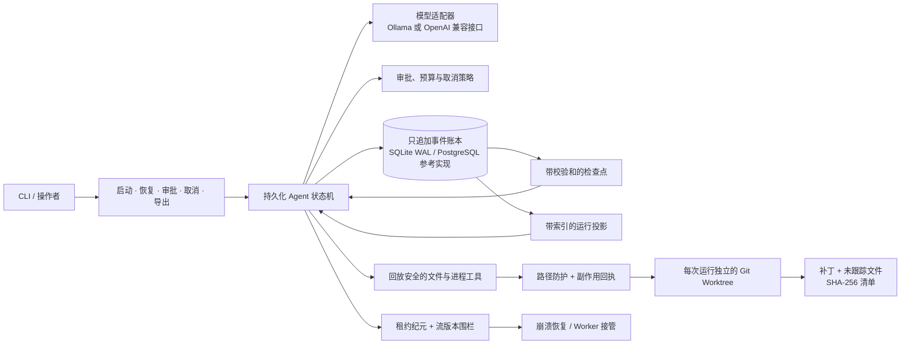
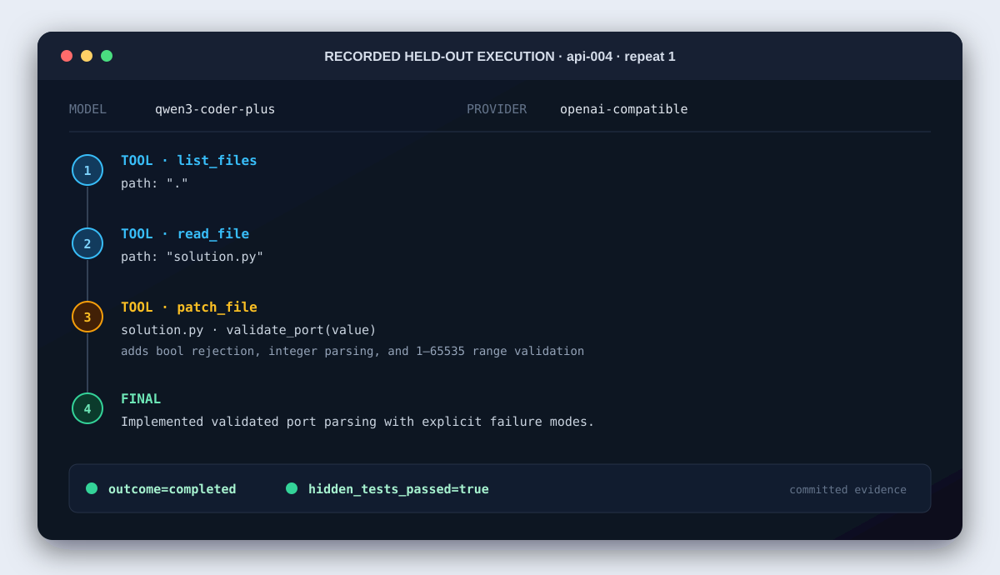

# ForgeReplay

<p align="center">
  <a href="README.md">English</a> | <strong>中文</strong>
</p>

[](https://github.com/zelinyang-create/forge-replay/actions/workflows/ci.yml)
[](pyproject.toml)
[](LICENSE)

ForgeReplay 是一个具备持久执行与回放感知能力的 Coding Agent Harness，构建于
[`rasbt/mini-coding-agent`](https://github.com/rasbt/mini-coding-agent)
的小型模型/工具循环之上。它是一个采用 Apache-2.0 许可证的分支：上游项目提供了原始的
单文件 Agent、工作区上下文、结构化工具、审批模式、JSON 会话恢复、上下文压缩和有界委派；
本分支新增了 `forge_replay` 包及其持久执行与评测层。

上游快照以标签 `upstream-baseline-717cae4` 保留。

**招聘者快速入口：** [架构](#架构) ·
[实测证据](#实测证据) · [五分钟配置](#快速开始) ·
[生产就绪评审](docs/production-p1-p5-overall-review.md)

## 架构



不可变事件账本是审计事实来源。检查点和索引投影用于加速恢复与热路径决策，
每一项变更都被限制在所属 Worktree 中，并以确定性标识和副作用回执记录。

## ForgeReplay 新增能力

- SQLite 中的类型化只追加运行时事件，支持 WAL、校验和、不可变 Blob、
  确定性投影以及从检查点尾部回放。
- 持久化模型/工具状态机，具备稳定的 UUIDv7 标识、审批指纹、确定性预算预留、
  取消、按尝试记录的 Provider 重试事件，以及由纪元和流版本围栏保护的可过期运行租约。
- 用于审批和取消的独立幂等控制命令。稳定的命令 ID 会回放原始已提交结果；
  过期 UI 版本和旧 Worker 会以失败关闭方式拒绝执行。
- 运行时热路径上的自动校验和检查点、向更早快照逐级回退，以及上限为 64 个事件的提示词工作集。
- 带索引、具备事务性的模型/工具运行投影，避免 Runtime 决策扫描完整历史，
  同时继续以事件账本作为审计事实来源。
- 每次运行独立的 Git Worktree 与严格路径校验。默认拒绝源检出目录中的用户变更，
  且绝不会静默重置这些变更。
- 可安全回放的文件读取、写入、补丁、列表和搜索。变更使用修改前/后的 SHA-256 回执和原子替换，
  以便在崩溃后完成对账。
- 仅 argv 的有界进程执行，具备输出限制、超时/取消、进程树清理，
  并通过显式 `UNCERTAIN` 状态避免在模糊崩溃后重放任意 Shell 副作用。
- 以二进制补丁、复制的未跟踪文件和 SHA-256 清单导出结果；
  仅清理干净的 Worktree，并支持持久取消和脱敏事件轨迹导出。
- 确定性崩溃一致性测试、投影微基准，以及冻结的 24 任务真实模型 Coding 测试集，
  按 16/8 划分开发集和留出集。

## 生产控制平面参考实现

v0.4 生产路径加入了代码级 P1-P5 控制能力，但并不声称本地检出目录已经是托管的正式商用服务：

- 经过证明且以摘要锁定的 OCI/gVisor 执行 Provider。`--production` 模式会在创建运行前
  检查是否已选择该 Provider；如果没有则失败关闭。每次 CLI 运行退出时都会销毁其容器。
- 以 PostgreSQL 作为权威控制平面，支持租户 RLS、流版本 CAS、
  至少一次的 `SKIP LOCKED` 命令队列、事务 Outbox 和幂等 API 创建。
- 租户隔离的内容寻址制品、确定性工作区快照、租约纪元围栏以及
  Worker 接管时的重连或恢复。
- 受策略约束的模型网关，具备熔断、重试预算、分层成本预留和版本化价格表结算。
- 失败关闭的 Shadow/Canary 与正式发布就绪门禁、区域代次围栏、签名备份/供应链证据，
  以及防篡改审计链。

实现评审明确区分了确定性的本地证据和部署证据；后者包括实时 gVisor Canary、
PostgreSQL 并发、多主机稳定性测试、多可用区故障转移、28 天 SLO 和渗透测试。
详见 [v0.4 P1-P5 总体评审](docs/production-p1-p5-overall-review.md)。

## 快速开始

安装 Python 3.10+、Git、`uv` 和 Ollama，然后拉取模型：

```bash
git clone https://github.com/zelinyang-create/forge-replay.git
cd forge-replay
uv sync
ollama pull qwen3.5:4b
```

在一个干净的 Git 仓库中启动持久化运行：

```bash
uv run forge-replay start "Fix the failing parser tests" --repo /path/to/repo
```

默认主机执行器仅用于开发。生产模式调用必须选择 gVisor Provider 和不可变镜像摘要：

```bash
uv run forge-replay start "Fix the failing parser tests" \
  --repo /path/to/repo --production --execution-provider gvisor \
  --sandbox-image sha256:<64-hex-digest>
```

如果 Provider、摘要或运行时证明缺失或不安全，命令会失败关闭。

除非显式传入对应的自动审批标志，否则文件变更和进程执行都会暂停并等待审批。
批准待处理调用后继续运行：

```bash
uv run forge-replay approve <approval-id> allow --reason "reviewed exact call"
uv run forge-replay resume <run-id>
```

检查状态、取消运行、导出脱敏轨迹或保留结果：

```bash
uv run forge-replay status <run-id>
uv run forge-replay cancel <run-id> --reason "no longer needed"
uv run forge-replay trace <run-id> --output trace.json
uv run forge-replay export <run-id>
```

原始教学 CLI 仍以 `mini-coding-agent` 的形式保留，作为兼容上游的基线。

### 已记录的执行轨迹



这是已提交的 `api-004` 留出集运行的可视化：Agent 列出工作区、读取目标文件、
应用经过校验的补丁、正常进入终态，并通过隐藏评估器。底层
[运行记录](benchmarks/results/bailian-qwen3-coder-plus-heldout-r3/runs/api-004-r1/run.json)、
[模型输出](benchmarks/results/bailian-qwen3-coder-plus-heldout-r3/runs/api-004-r1/model-outputs.json)
和[最终补丁](benchmarks/results/bailian-qwen3-coder-plus-heldout-r3/runs/api-004-r1/final.patch)
均已提交，可供检查。它只是一轮运行的证据，并不代表整个测试集的结果。

## 实测证据

以下所有数值均为本地确定性测量结果，不是生产环境 SLA：

| 评测项 | 结果 | 有效解读 |
|---|---:|---|
| 共享文件副作用崩溃边界 | 加固版本 24/24 次安全恢复；基线版本 0/24 次安全终止 | 两个注入文件崩溃窗口下的 Harness 恢复语义 |
| 重复文件副作用 | 24 次加固故障运行中为 0 | 覆盖的确定性场景中没有重复写入 |
| 自动恢复延迟 | P50 20.1 ms；P95 39.0 ms | 本地恢复处理器耗时，不含真实模型调用 |
| 10,000 事件投影回放 | 完整回放 41.58 ms；从 200 事件检查点尾部回放 0.78 ms | CPU Reducer 微基准加速 53.21 倍，不是端到端恢复延迟 |
| SQLite 投影恢复 | 完整恢复 P50 125.35 ms；从 50 事件尾部恢复 P50 8.57 ms | 两条路径各连续采样 20 次的本地账本端到端恢复加速 14.63 倍 |
| 100,000 事件 Runtime 热路径查询 | 带索引 P50 1.72-2.13 ms；冻结的旧版扫描为 1.27-1.38 s | 4 个本地 SQLite Store 调用在 20 组配对样本中加速 647-742 倍，不是 Agent 延迟 |
| 过期 Worker 围栏 | 10,000/10,000 次旧纪元写入被拒绝；0 次被接受 | 单进程 SQLite 纪元接管压力测试，不是分布式稳定性测试或容量 SLA |
| 百炼 `qwen3-coder-plus` 留出集 Coding | 14/24 次运行通过（58.3%）；按任务聚类 Bootstrap 的 95% CI 为 25.0%-87.5% | 8 个冻结任务 × 3 次重复，temperature 0，关闭思考，禁用进程工具 |
| 百炼端到端运行延迟 | P50 11.65 s；P95 16.87 s | 模型 + Harness 文件工具循环 + 持久化；隐藏评估器在此后运行 |

报告、逐次运行补丁/模型输出、Git 元数据、平台信息和分母均位于
[`benchmarks/results`](benchmarks/results)。已发布的百炼结果使用官方
OpenAI 兼容端点和 `qwen3-coder-plus`：24 次运行均正常进入 Harness 终态，
其中 14 次通过隐藏测试。8 个任务中有 5 个至少成功一次，4 个在三次重复中全部成功。
重复运行之间存在相关性，因此报告使用按任务聚类的 Bootstrap，而不是把 24 行结果当作
相互独立的任务。

使用环境变量运行相同测试集；切勿把密钥写入配置或提交到 Git 的命令中：

```bash
uv run python -m forge_replay.eval.real_model_benchmark \
  --provider openai-compatible \
  --base-url https://dashscope.aliyuncs.com/compatible-mode/v1 \
  --api-key-env DASHSCOPE_API_KEY \
  --split held_out --repeats 3 --model qwen3-coder-plus \
  --i-understand-model-generated-code-runs-locally
```

### 复现确定性证据

确定性崩溃和回放基准不需要模型或 API 密钥：

```bash
uv run python -m forge_replay.eval.harness_conformance \
  --tasks 12 --output artifacts/harness-conformance.json

uv run python -m forge_replay.eval.projection_benchmark \
  --events 10000 --tail 200 --iterations 50 \
  --output artifacts/projection-replay.json

uv run python -m forge_replay.eval.sqlite_recovery_benchmark \
  --events 2000 --tail 50 --iterations 20 \
  --output artifacts/sqlite-recovery.json

uv run python -m forge_replay.eval.runtime_hot_path_benchmark \
  --history-sizes 10000 --iterations 20 --warmups 3 \
  --output artifacts/runtime-hot-path.json
```

比较不同机器的数值前，请先验证实现：

```bash
uv run ruff check .
uv run pytest -q
```

基准报告包含 Git SHA、Python 版本、平台和样本数量。请比较采用相同 Fixture 的结果；
CPU 微基准不会被表述为端到端 Agent 延迟。

## 安全边界

Git Worktree 可以保护基础检出目录，但它不是操作系统沙箱。进程监督器无法阻止生成的代码
读取主机、访问网络或影响当前账户可访问的服务。不要在含有凭据的工作站上自动批准进程。
使用临时虚拟机/容器、低权限账户、无挂载密钥和默认拒绝网络，进行真实模型评测。

项目并不声称任意进程可以做到恰好执行一次。只读工具可以重试；文件写入/补丁可检测且可对账；
模糊的进程崩溃会进入 `UNCERTAIN` 状态并要求人工关注。

关于架构、证据、延期范围和剩余风险，参见
[技术设计](docs/harness-technical-design.md)、
[生产升级设计](docs/production-coding-agent-upgrade.md)、
[v0.3 生产 P0 评审](docs/production-p0-implementation-review.md)、
[v0.4 P1-P5 总体评审](docs/production-p1-p5-overall-review.md)，以及历史
[v0.2 实现评审](docs/implementation-review.md)。

## 上游教程与基线文档

本 README 的其余内容保留自上游项目，用于署名和说明基线用法。

### 修改说明

ForgeReplay 新增了 `forge_replay` 包、持久化 CLI、测试、基准和设计/评审文档。
上游许可证和历史记录均予以保留；由上游衍生且经过修改的文件，可通过 Git 历史和本发布说明识别。

<a href="https://magazine.sebastianraschka.com/p/components-of-a-coding-agent">
  
</a>

<br>

**[详细教程：Coding Agent 的组成部分](https://magazine.sebastianraschka.com/p/components-of-a-coding-agent)**

&nbsp;
## 六个核心组成部分

<a href="https://magazine.sebastianraschka.com/p/components-of-a-coding-agent">
  
</a>

本 Coding Harness 由六个实用构件组成：

1. **实时仓库上下文**<br>
   Agent 会预先收集稳定的工作区事实，例如仓库结构、指令和 Git 状态。
2. **提示词结构与缓存复用**<br>
   使用稳定的提示词前缀，并与持续变化的请求、记录和记忆分离，
   使重复模型调用可以高效复用静态部分。
3. **结构化工具、校验和权限**<br>
   模型通过带有输入校验、工作区路径校验和审批门禁的具名工具工作，
   而不是自由执行任意操作。
4. **上下文压缩与输出管理**<br>
   截断过长输出、去除重复读取，并压缩较早的记录条目，使提示词大小始终可控。
5. **记录、记忆和恢复**<br>
   Runtime 同时保存完整持久记录和较小的工作记忆，因此会话能够在恢复时
   通过工作记忆保留重要状态。
6. **委派和有界子 Agent**<br>
   可以把有明确边界的子任务委派给辅助 Agent；它们会继承足够的上下文，
   同时在既定限制内运行。

&nbsp;
## 环境要求

你需要：

- Python 3.10+
- 已安装 Ollama
- 已拉取一个 Ollama 模型

可选：

- 使用 `uv` 管理环境并运行 `mini-coding-agent` CLI 入口

本项目除 Python 标准库外没有其他 Python 运行时依赖。如果不想使用 `uv`，
可以直接通过 `python mini_coding_agent.py` 运行。

&nbsp;
## 安装 Ollama

在计算机上安装 Ollama，确保 Shell 中可以使用 `ollama` 命令。

官方安装链接：[ollama.com/download](https://ollama.com/download)

然后进行验证：

```bash
ollama --help
```

启动服务：

```bash
ollama serve
```

在另一个终端中拉取模型。例如：

```bash
ollama pull qwen3.5:4b
```

Qwen 3.5 模型库：

- [ollama.com/library/qwen3.5](https://ollama.com/library/qwen3.5)

本项目默认使用 `qwen3.5:4b`。如果内存充足，值得尝试 `qwen3.5:9b` 等更大模型，
或其他更大的 Qwen 3.5 版本。Agent 只会把提示词发送到 Ollama 的 `/api/generate` 端点。

&nbsp;
## 项目配置

克隆本仓库或你自己的 Fork，然后进入目录：

```bash
git clone https://github.com/rasbt/mini-coding-agent.git
cd mini-coding-agent
```

如果你先创建了 Fork，请使用自己的 Fork URL：

```bash
git clone https://github.com/<your-github-user>/mini-coding-agent.git
cd mini-coding-agent
```

&nbsp;
## 基本用法

启动 Agent：

```bash
cd mini-coding-agent
uv run mini-coding-agent
```

不使用 `uv` 时，直接运行脚本：

```bash
cd mini-coding-agent
python mini_coding_agent.py
```

默认配置：

- 模型：`qwen3.5:4b`
- 审批：`ask`

具体用法示例参见 [EXAMPLE.md](EXAMPLE.md)。

&nbsp;
## 审批模式

Shell 命令和文件写入等高风险工具会经过审批门禁。

- `--approval ask`<br>
  在执行高风险操作前提示审批（默认且推荐）
- `--approval auto`<br>
  自动允许高风险操作，包括由模型执行任意命令和写入文件；
  仅可用于可信提示词和可信仓库
- `--approval never`<br>
  拒绝高风险操作

示例：

```bash
uv run mini-coding-agent --approval auto
```

&nbsp;
## 恢复会话

Agent 会把会话保存在目标工作区根目录下的：

```text
.mini-coding-agent/sessions/
```

恢复最近一次会话：

```bash
uv run mini-coding-agent --resume latest
```

恢复指定会话：

```bash
uv run mini-coding-agent --resume 20260401-144025-2dd0aa
```

&nbsp;
## 交互命令

在 REPL 内，斜杠命令由 Agent 直接处理，不会作为普通任务发送给模型。

- `/help`<br>
  显示可用交互命令列表
- `/memory`<br>
  输出提炼后的会话记忆，包括当前任务、已跟踪文件和备注
- `/session`<br>
  输出当前已保存会话 JSON 文件的路径
- `/reset`<br>
  清除当前会话历史和提炼后的记忆，但继续留在 REPL 中
- `/exit`<br>
  退出交互会话
- `/quit`<br>
  退出交互会话；它是 `/exit` 的别名

&nbsp;
## 主要 CLI 参数

```bash
uv run mini-coding-agent --help
```

不使用 `uv` 时：

```bash
python mini_coding_agent.py --help
```

CLI 参数需要在 Agent 启动前传入，用于选择工作区、模型连接、恢复行为、审批模式和生成限制。

重要参数：

- `--cwd`<br>
  设置 Agent 要检查和修改的工作区目录；默认值：`.`
- `--model`<br>
  选择 Ollama 模型名称，例如 `qwen3.5:4b`；默认值：`qwen3.5:4b`
- `--host`<br>
  指定 Ollama 服务 URL（通常不需要）；默认值：`http://127.0.0.1:11434`
- `--ollama-timeout`<br>
  控制客户端等待 Ollama 响应的时长（通常不需要）；默认值：`300` 秒
- `--resume`<br>
  按 ID 恢复已保存会话，或使用 `latest`；默认行为：启动新会话
- `--approval`<br>
  控制高风险工具的处理方式：`ask`、`auto` 或 `never`；默认值：`ask`
- `--max-steps`<br>
  限制单次用户请求允许的模型和工具轮次；默认值：`6`
- `--max-new-tokens`<br>
  限制每一步的模型输出长度；默认值：`512`
- `--temperature`<br>
  控制生成采样随机性；默认值：`0.2`
- `--top-p`<br>
  控制生成的 Nucleus Sampling；默认值：`0.9`

&nbsp;
## 示例

参见 [EXAMPLE.md](EXAMPLE.md)。

&nbsp;
## 说明与技巧

- Agent 期望模型输出 `<tool>...</tool>` 或 `<final>...</final>`。
- 不同 Ollama 模型遵循这些指令的可靠性不同。
- 如果模型不能很好地遵循格式，请使用指令遵循能力更强的模型。
- Agent 有意保持小型化并针对可读性优化，而不是以健壮性为首要目标。
