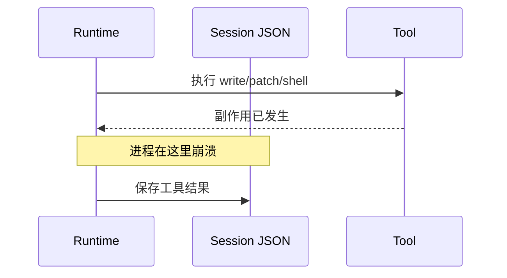
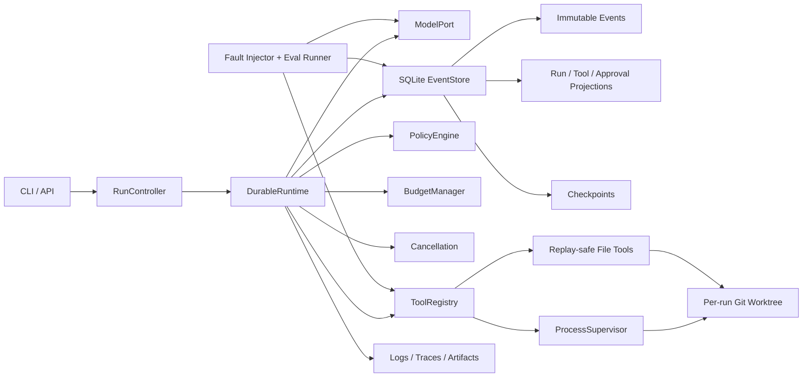
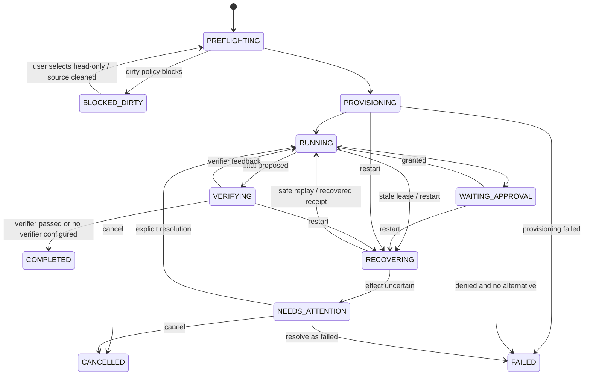
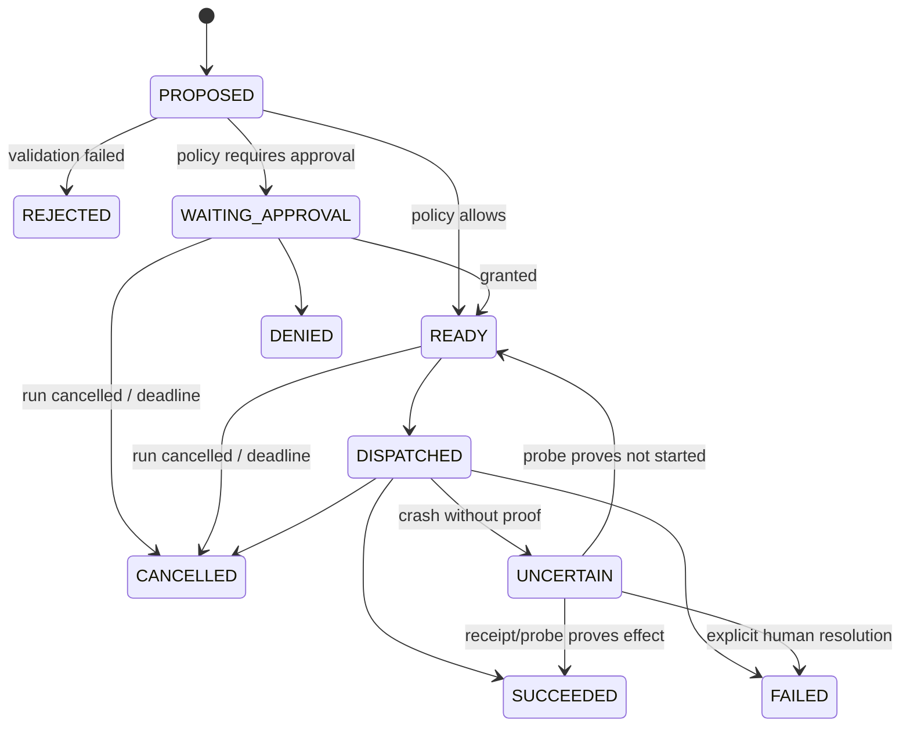

# ForgeReplay Durable Coding Agent Harness 技术设计报告

> 状态：Draft for implementation  
> 设计基线：`rasbt/mini-coding-agent@717cae4`  
> 开发仓库：`zelinyang-create/forge-replay`  
> 开发分支：`codex/durable-agent-runtime`  
> 目标读者：实现者、代码审查者、后续面试官  
> 最后更新：2026-08-19

## 1. 执行摘要

ForgeReplay 不是重写一个更大的 Coding Agent，也不以增加更多模型、更多工具或 Web UI 为主要目标。它是在一个约 1,000 行的轻量 Coding Agent 基线上，增加一套可审计、可恢复、可隔离、可评测的执行 Harness。

项目要解决的核心问题是：模型已经请求了工具，工具也可能已经修改文件或运行命令，但 Agent 在保存结果前崩溃。系统重启后，如何判断这个工具应该复用结果、安全重试，还是必须暂停并请求人工处理？

本设计给出的答案是：

1. 使用不可变的类型化事件记录每个模型调用、审批、工具派发、执行结果、预算和取消决定。
2. 使用 SQLite 在短事务中原子地提交事件及查询投影。
3. 将一次任务建模为显式 Run 状态机，而不是依赖 `ask()` 的局部循环变量。
4. 为文件工具保存执行前后 SHA-256，通过恢复探针判断副作用是否已经完成。
5. 对无法证明结果的任意 Shell 调用标记 `UNCERTAIN`，禁止静默重放。
6. 每个 Run 使用独立 Git Worktree，避免覆盖用户当前 Checkout，并支持并发任务。
7. 将工具权限从 `risky: bool` 升级为能力和风险分类，审批绑定规范化操作摘要。
8. 通过稳定故障点、可复现 Coding Task、统一 Baseline Adapter 和 baseline/hardened 配对实验验证可靠性。

项目不承诺“所有工具 exactly-once”。准确的语义是：读取工具可安全复用或重试；文件写入工具提供可检测幂等；支持幂等键的外部 API 可以传递调用键；任意 Shell 在证据不足时进入 `UNCERTAIN`。

## 2. 上游基线与个人贡献边界

### 2.1 上游已经提供的能力

以下能力来自 `rasbt/mini-coding-agent`，应保留来源说明，不能作为本项目从零实现的个人成果：

- 本地 Ollama 模型适配。
- 基础模型—工具循环。
- 工作区 Git 状态和项目文档快照。
- `list_files`、`read_file`、`search`、`run_shell`、`write_file`、`patch_file` 工具。
- JSON/XML 风格工具调用解析和参数校验。
- `ask / auto / never` 三种基础审批模式。
- 输出截断、历史读取去重和小型工作记忆。
- JSON 会话保存以及按 Session ID 重新加载。
- 有界、只读的单层子 Agent。
- `../`、符号链接逃逸和 Windows 大小写路径的基础测试。

当前基线测试为 `18 passed, 1 skipped`。这只是上游基线验证结果，不应作为个人项目量化成果。

### 2.2 本 Fork 计划新增的能力

个人贡献必须能由独立 Commit、测试和 A/B 报告证明，重点包括：

- 类型化 Runtime Events 和显式状态机。
- SQLite append-only 事件账本、投影和 Schema Migration。
- 执行级 Checkpoint、Resume、Projection Rebuild。
- 稳定 `tool_call_id`、调用状态机和恢复探针。
- 文件工具原子写、前后摘要和冲突检测。
- Shell Receipt、进程树监督、取消与 `UNCERTAIN` 处理。
- Git Worktree 隔离、Run/Repo Lease 和明确的结果处置流程。
- 多维预算、持久化审批和能力策略。
- Fault Injection、可复现任务集、A/B Runner 和报告生成。
- 结构化日志、Trace 和可审计运行产物。

README 应长期保留 `Based on rasbt/mini-coding-agent`，并分别列出 `Upstream capabilities` 与 `Added in this fork`。同时保留 Apache-2.0 的版权和 LICENSE；修改过的文件或发行说明应提供显著 Change Notice。若上游将来增加 NOTICE，应一并保留；当前上游没有 NOTICE 时不人为伪造。

## 3. 当前实现审计

### 3.1 当前执行链

当前 `MiniAgent.ask()` 的核心顺序是：

```text
保存用户消息
  -> 调用模型
  -> 解析模型输出
  -> run_tool()
  -> 保存工具结果到 Session JSON
  -> 更新内存
  -> 下一轮模型调用
```

这条链可以完成短任务，但还不是 Durable Runtime。

### 3.2 关键缺口

| 缺口 | 当前行为 | 风险 |
|---|---|---|
| Session 写入 | `Path.write_text()` 覆盖整个 JSON | 写入中崩溃可能得到截断文件 |
| 工具记录顺序 | 先执行副作用，再保存结果 | 写后崩溃无法判断是否应重试 |
| 模型响应 | 合法工具调用不会先保存原始响应 | 重启后不能稳定复放解析结果 |
| 防重复 | 只观察最近两个相同调用 | 是循环抑制，不是幂等 |
| Resume | 加载 history/memory 继续聊天 | 不能恢复 in-flight 模型或工具步骤 |
| 审批 | 同步 `input()`，不持久化 | 重启后审批证据丢失 |
| Budget | `tool_steps/attempts` 是局部变量 | 重启后预算被重置 |
| Shell | `shell=True` + 直接阻塞执行 | 可逃逸工作区，无法可靠管理进程树 |
| 文件写入 | 直接 `write_text()` | 非原子、无前置条件和效果证明 |
| 工作区 | 直接修改用户仓库根目录 | 覆盖用户改动，并发 Run 相互污染 |
| Memory | 保存 history 后再更新 memory | 两步之间崩溃会丢失最新 memory |
| Reset | 直接清空 history/memory | 审计历史不可追溯 |

### 3.3 最危险的崩溃窗口



如果在标注位置崩溃，现有 Session 中没有工具已经执行的证据。恢复后重新询问模型可能导致重复写入、重复命令或更严重的外部副作用。

## 4. 设计目标、非目标与系统不变量

### 4.1 设计目标

1. 所有重要意图在外部动作之前持久化。
2. 重启后能够定位到最后一个明确 Run Phase。
3. 可证明安全的工具自动恢复；不可证明的工具安全停机。
4. 审批、预算、取消和父子关系跨进程有效。
5. 用户当前 Checkout 不被 Agent 直接修改。
6. 所有状态变化可以由事件流重建并被人审计。
7. 使用少量依赖保持代码可读，避免引入大型 Agent 框架。
8. 同一任务、模型和预算下能进行可复现的 baseline/hardened 对比。

### 4.2 非目标

- 不实现 LangGraph 或通用工作流引擎。
- 不在第一版实现多机调度、多 Agent DAG、Web UI 或 MCP 市场。
- 不宣称 Worktree 是文件系统、网络或系统权限沙箱。
- 不把 SQLite 事务错误地延伸到文件系统、Shell 或 HTTP。
- 不序列化 Python 栈帧、协程、文件句柄或 `subprocess` 对象。
- 不承诺任意 Shell exactly-once。
- 不在第一版自动合并、Force Push、部署或发布。

### 4.3 必须持续满足的不变量

- `(session_id, seq)` 和 `event_id` 唯一，`seq` 单调递增。
- 一个 Run 的 `execution_status` 最多提交一个不可逆终态；`workspace_disposition` 独立演进，不算第二个执行终态。
- 同一 `tool_call_id` 最多只有一个逻辑成功结果。
- 未获有效审批的受限工具永远不能进入 `DISPATCHED`。
- Resume 不得自动放宽 Budget Limit、减少 Consumed、遗失 Reservation 或重新起算 Deadline；恢复后继续执行可以继续消费剩余预算。
- 审批决策必须绑定工具版本、规范化参数、工作区和策略版本。
- Harness 的结构化文件工具只能修改本 Run Worktree；未沙箱化的通用 Shell 不提供文件系统或网络隔离保证。
- 在确定性 FakeModel 场景下，恢复后的 Worktree Digest 应与无故障 Golden Run 一致。
- 无法证明结果的非幂等工具不能静默重放。
- Dirty Worktree 不得被后台自动删除。
- 终态事件提交前不得向用户显示“任务完成”。

## 5. 总体架构



控制面分三层：

1. **Worktree**：隔离 Git 改动和并发任务。
2. **Policy + Path Guard**：约束 Harness 自带的结构化工具。
3. **Process Supervisor**：管理进程生命周期、输出、Deadline 和取消，但不限制文件系统、网络或凭据。强 Sandbox 仅属于后续隔离执行后端。

## 6. 推荐代码结构

新代码使用 `src` 布局，保留原单文件作为兼容入口，逐阶段迁移而不是一次性重写：

```text
src/forge_replay/
  cli.py
  runtime/
    controller.py          # start/resume/cancel/finalize
    state.py               # Run reducer 与合法状态转换
    events.py              # 类型化事件与版本兼容
    recovery.py            # 恢复决策和投影重建
    leases.py              # Run lease / repo management lock
  persistence/
    schema.py              # DDL、PRAGMA、migration
    store.py               # SQLite 事务和事件追加
    checkpoints.py
    blobs.py
  model/
    base.py                # ModelPort
    ollama.py              # 迁移现有 Ollama client
    retry.py
  tools/
    base.py                # ToolSpec/Call/Receipt/RecoveryDecision
    registry.py
    filesystem.py
    git.py
    shell.py
    delegate.py
  workspace/
    inspector.py
    worktrees.py
    paths.py
    cleanup.py
  policy/
    risks.py
    engine.py
    approvals.py
  process/
    supervisor.py
    windows_job.py
    posix_group.py
  observability/
    logging.py
    tracing.py
    artifacts.py
  eval/
    scenarios.py
    faults.py
    runner.py
    metrics.py

tests/
  unit/
  integration/
  fault/
  fixtures/tasks/

mini_coding_agent.py       # 兼容入口，最终调用 forge_replay.cli
```

持久化边界模型推荐使用 Pydantic v2 Discriminated Union；数据库使用 Python 标准库 `sqlite3`。Pydantic 只负责外部边界验证和版本化，不参与状态机控制流。

## 7. 核心领域模型

### 7.1 工具效果类别

| 效果类别 | 示例 | 恢复语义 |
|---|---|---|
| `PURE` | `read_file`、`list_files`、受限搜索 | 复用已保存结果；必要时可安全重执行 |
| `DETECTABLE_IDEMPOTENT` | 带前后摘要的 `write_file`、`patch_file` | Recovery Probe 判断已完成、未开始或冲突 |
| `EXTERNALLY_IDEMPOTENT` | 支持 Idempotency-Key 的外部 API | 使用调用级幂等键恢复 |
| `NON_IDEMPOTENT` | 任意 Shell、部署、发消息 | 派发后无可靠 Receipt 时进入 `UNCERTAIN` |

### 7.2 关键接口

```python
class DurableRuntime:
    def start_turn(self, session_id: str, message: str) -> str: ...
    def run_until_blocked(self, run_id: str) -> "RunOutcome": ...
    def resume_run(self, run_id: str) -> "RunOutcome": ...
    def request_cancel(self, run_id: str, reason: str, actor: str) -> None: ...
    def decide_approval(self, approval_id: str, decision: str, actor: str) -> None: ...
    def resolve_uncertain_tool(self, tool_call_id: str, resolution: str, actor: str) -> None: ...
    def inspect_run(self, run_id: str) -> "RunView": ...


class DurableTool(Protocol):
    spec: "ToolSpec"

    def prepare(self, call: "ToolCall", ctx: "ToolContext") -> "PreparedToolCall": ...
    def execute(self, prepared: "PreparedToolCall", cancel: "CancelToken") -> "ToolReceipt": ...
    def recover(self, prepared: "PreparedToolCall", evidence: "ExecutionEvidence") -> "RecoveryDecision": ...
```

`RecoveryDecision` 只能返回有限枚举：

- `COMPLETED`
- `NOT_STARTED_RETRY_SAFE`
- `STILL_RUNNING`
- `FAILED`
- `UNCERTAIN`

## 8. Run 与 Tool 状态机

### 8.1 Run 执行状态与工作区处置状态

执行结果和 Worktree 处置是两个正交维度，不能混成一个状态机：

- `execution_status`：`ACTIVE / COMPLETED / FAILED / CANCELLED / BUDGET_EXCEEDED / NEEDS_ATTENTION`。
- `phase`：仅描述 Active Run 当前步骤，例如 `PREFLIGHTING / PROVISIONING / AWAITING_MODEL / WAITING_APPROVAL / EXECUTING_TOOL / VERIFYING / RECOVERING`。
- `workspace_disposition`：`NONE / ACTIVE / PRESERVED / EXPORTED / INTEGRATED / DISCARDED / CLEANED / ORPHANED / QUARANTINED`。



所有非终态 Phase 都有全局 `cancel -> CANCELLED`、`deadline/budget -> BUDGET_EXCEEDED` 和不可恢复错误 `-> FAILED` 转换，上图为可读性没有重复画出。`COMPLETED` 只表示 Agent 执行和配置的验证阶段已经结束，不表示结果已合入用户分支。无验证器时必须在结果中明确 `verification_status=NOT_CONFIGURED`。

Worktree 在执行终止后通常进入 `PRESERVED`。之后可以多次导出 Artifact，最终再 `INTEGRATED`、`DISCARDED` 或 `CLEANED`；导出不是不可逆终态。取消、失败和预算超限同样可以导出残留成果。

### 8.2 Tool Call 状态机



约束：

- `tool_call_id` 在模型响应解析后创建，恢复时保持不变。
- 同一调用可以有多个物理 Attempt，但只有一个逻辑 Call。
- 每个重试创建独立 `tool_attempt`；旧 Attempt 不得被覆盖。
- `tool_call_id` 是关联标识，不等同于幂等保证。
- `NON_IDEMPOTENT + DISPATCHED` 无证明时不得自动回到 `READY`。

## 9. 类型化事件

### 9.1 Event Envelope

```python
class EventEnvelope(BaseModel):
    event_id: UUID
    schema_version: int = 1
    session_id: str
    turn_id: str | None = None
    run_id: str | None = None
    seq: int
    type: str
    occurred_at: datetime
    monotonic_ns: int | None = None
    process_instance_id: str
    boot_id: str | None = None
    causation_event_id: UUID | None = None
    correlation_id: str | None = None
    payload: EventPayload
```

规则：

- 事件写入后不可修改。
- 事件顺序只看 `seq`，不能依赖墙上时间。
- Payload 使用 Discriminator，不使用任意字典冒充类型安全。
- 受配额约束的原始模型输出和已观察工具输出进入 Blob Store；事件只保存摘要、截断标记和引用。
- Secret、Authorization、环境变量和敏感参数写入前必须脱敏。
- Event Schema 和 Reducer Schema 都必须带版本。
- `monotonic_ns` 只用于同一 Process/Boot Segment 内测量；跨重启 Deadline 使用持久 UTC，不能拼接不同进程的单调时钟。

### 9.2 事件集合

会话与 Run：

- `SessionCreated`
- `SessionReset`
- `UserMessageReceived`
- `TurnStarted`
- `RunCreated`
- `RunStarted`
- `RunLeaseAcquired`
- `RunLeaseReleased`
- `RunCompleted`
- `RunVerificationStarted`
- `RunVerificationPassed`
- `RunVerificationFailed`
- `RunFailed`
- `RunCancelled`
- `RunBudgetExceeded`
- `RunNeedsAttention`
- `RunFinalized`
- `PreflightBlocked`
- `ProvisioningFailed`

模型：

- `ModelCallPrepared`
- `ModelCallStarted`
- `ModelResponseReceived`
- `ModelCallFailed`
- `ModelOutputRejected`
- `FinalAnswerCommitted`

工具：

- `ToolCallProposed`
- `ToolCallValidated`
- `ToolCallRejected`
- `ToolApprovalRequested`
- `ToolApprovalGranted`
- `ToolApprovalDenied`
- `ToolExecutionDispatched`
- `ToolExecutionSucceeded`
- `ToolExecutionFailed`
- `ToolExecutionCancelled`
- `ToolExecutionUncertain`
- `ToolExecutionRecovered`

预算、取消与恢复：

- `BudgetReserved`
- `BudgetConsumed`
- `BudgetReservationReleased`
- `BudgetConsumptionUnknown`
- `BudgetExceeded`
- `CancellationRequested`
- `CancellationObserved`
- `ProcessTerminationRequested`
- `RecoveryStarted`
- `RecoveryDecisionMade`
- `UncertainToolResolved`
- `WorkspaceDriftDetected`
- `WorktreeProvisioningPlanned`
- `WorktreeProvisioned`
- `WorktreeProvisioningUncertain`
- `WorktreePreserved`
- `WorkspaceExported`
- `WorkspaceIntegrated`
- `WorktreeCleanupPlanned`
- `WorktreeCleaned`
- `WorktreeOrphaned`
- `WorktreeQuarantined`
- `RunLeaseTakenOver`
- `RunLeaseFenced`
- `ProjectionRebuilt`
- `MigrationApplied`

上述业务事实必须能够重建 `execution_status`、`phase` 和 `workspace_disposition`。数据库连接心跳、查询缓存等纯操作性字段可以不进入业务 Reducer，但不得影响恢复决策或对外报告。

## 10. SQLite 数据模型

事件是事实来源；`runs/tool_calls/approvals` 是查询、互斥和恢复用的投影。

所有 Durable State 放在源仓库外：

```text
%LOCALAPPDATA%/forge-replay/state/<repo-id>/
  ledger.sqlite3
  blobs/
  receipts/
  locks/
  ownership-markers/
```

`repo-id` 基于规范化 Git Common Directory，而不是单个 Worktree 的 `show-toplevel`。状态目录由 Harness 创建并限制权限；结构化文件工具不能访问。Ownership Marker 也位于这里，不放在可被 Agent 修改的 Worktree 内。SQLite、Git Worktree 列表与 Marker 三方不一致时进入 `QUARANTINED`。

```sql
PRAGMA foreign_keys = ON;
PRAGMA journal_mode = WAL;
PRAGMA busy_timeout = 5000;
PRAGMA synchronous = FULL;

CREATE TABLE sessions (
    session_id          TEXT PRIMARY KEY,
    workspace_root      TEXT NOT NULL,
    created_at          TEXT NOT NULL,
    status              TEXT NOT NULL,
    epoch               INTEGER NOT NULL DEFAULT 0,
    next_seq            INTEGER NOT NULL DEFAULT 1,
    config_json         TEXT NOT NULL,
    last_event_id       TEXT
);

CREATE TABLE turns (
    turn_id             TEXT PRIMARY KEY,
    session_id          TEXT NOT NULL REFERENCES sessions(session_id),
    user_event_id       TEXT NOT NULL,
    created_at          TEXT NOT NULL,
    status              TEXT NOT NULL,
    active_run_id       TEXT
);

CREATE TABLE runs (
    run_id                  TEXT PRIMARY KEY,
    turn_id                 TEXT NOT NULL REFERENCES turns(turn_id),
    session_id              TEXT NOT NULL REFERENCES sessions(session_id),
    parent_run_id           TEXT REFERENCES runs(run_id),
    parent_tool_call_id     TEXT,
    execution_status        TEXT NOT NULL,
    phase                   TEXT,
    workspace_disposition   TEXT NOT NULL DEFAULT 'NONE',
    base_repo_root          TEXT NOT NULL,
    base_commit_sha         TEXT NOT NULL,
    worktree_path           TEXT,
    worktree_branch         TEXT,
    created_at              TEXT NOT NULL,
    started_at              TEXT,
    finished_at             TEXT,
    last_event_seq          INTEGER NOT NULL DEFAULT 0,
    lease_owner             TEXT,
    lease_epoch             INTEGER NOT NULL DEFAULT 0,
    lease_expires_at        TEXT,
    cancel_requested_at     TEXT,
    cancel_reason           TEXT,
    deadline_at             TEXT,
    budget_limits_json      TEXT NOT NULL,
    budget_consumed_json    TEXT NOT NULL,
    terminal_reason_json    TEXT
);

CREATE TABLE events (
    event_id             TEXT PRIMARY KEY,
    session_id           TEXT NOT NULL REFERENCES sessions(session_id),
    turn_id              TEXT REFERENCES turns(turn_id),
    run_id               TEXT REFERENCES runs(run_id),
    seq                  INTEGER NOT NULL,
    event_type           TEXT NOT NULL,
    schema_version       INTEGER NOT NULL,
    occurred_at          TEXT NOT NULL,
    causation_event_id   TEXT,
    correlation_id       TEXT,
    payload_json         TEXT NOT NULL,
    payload_sha256       TEXT NOT NULL,
    UNIQUE(session_id, seq)
);

CREATE INDEX events_by_run ON events(run_id, seq);
CREATE INDEX events_by_type ON events(event_type, occurred_at);

CREATE TABLE tool_calls (
    tool_call_id          TEXT PRIMARY KEY,
    run_id                TEXT NOT NULL REFERENCES runs(run_id),
    response_event_id     TEXT NOT NULL REFERENCES events(event_id),
    ordinal               INTEGER NOT NULL,
    tool_name             TEXT NOT NULL,
    tool_version          TEXT NOT NULL,
    args_json             TEXT NOT NULL,
    args_sha256           TEXT NOT NULL,
    approval_fingerprint  TEXT NOT NULL,
    effect_class          TEXT NOT NULL,
    idempotency_key       TEXT,
    state                 TEXT NOT NULL,
    precondition_json     TEXT,
    final_output_blob_sha256 TEXT,
    final_error_json      TEXT,
    UNIQUE(run_id, response_event_id, ordinal)
);

CREATE INDEX tool_calls_by_run_state ON tool_calls(run_id, state);

CREATE TABLE tool_attempts (
    attempt_id            TEXT PRIMARY KEY,
    tool_call_id          TEXT NOT NULL REFERENCES tool_calls(tool_call_id),
    attempt_no            INTEGER NOT NULL,
    state                 TEXT NOT NULL,
    executor_identity_json TEXT,
    dispatched_at         TEXT,
    completed_at          TEXT,
    receipt_json          TEXT,
    output_blob_sha256    TEXT,
    error_json            TEXT,
    UNIQUE(tool_call_id, attempt_no)
);

CREATE TABLE approvals (
    approval_id          TEXT PRIMARY KEY,
    run_id               TEXT NOT NULL REFERENCES runs(run_id),
    subject_type         TEXT NOT NULL,
    subject_id           TEXT NOT NULL,
    fingerprint          TEXT NOT NULL,
    policy               TEXT NOT NULL,
    decision             TEXT,
    requested_at         TEXT NOT NULL,
    decided_at           TEXT,
    actor                TEXT,
    reason               TEXT
);

CREATE TABLE capability_grants (
    grant_id              TEXT PRIMARY KEY,
    approval_id           TEXT NOT NULL REFERENCES approvals(approval_id),
    run_id                TEXT NOT NULL REFERENCES runs(run_id),
    capability            TEXT NOT NULL,
    constraints_json      TEXT NOT NULL,
    granted_at            TEXT NOT NULL,
    expires_at            TEXT,
    revoked_at            TEXT
);

CREATE TABLE budget_reservations (
    reservation_id       TEXT PRIMARY KEY,
    run_id               TEXT NOT NULL REFERENCES runs(run_id),
    category             TEXT NOT NULL,
    amount_json          TEXT NOT NULL,
    state                TEXT NOT NULL,
    created_at           TEXT NOT NULL,
    settled_at           TEXT
);

CREATE TABLE checkpoints (
    checkpoint_id        TEXT PRIMARY KEY,
    run_id               TEXT NOT NULL REFERENCES runs(run_id),
    through_seq          INTEGER NOT NULL,
    state_version        INTEGER NOT NULL,
    phase                TEXT NOT NULL,
    snapshot_json        TEXT NOT NULL,
    snapshot_sha256      TEXT NOT NULL,
    created_at           TEXT NOT NULL,
    UNIQUE(run_id, through_seq)
);

CREATE TABLE blobs (
    sha256               TEXT PRIMARY KEY,
    byte_length          INTEGER NOT NULL,
    media_type           TEXT NOT NULL,
    compression          TEXT,
    content              BLOB NOT NULL,
    created_at           TEXT NOT NULL
);

CREATE TABLE schema_migrations (
    version              INTEGER PRIMARY KEY,
    applied_at           TEXT NOT NULL,
    checksum             TEXT NOT NULL
);
```

每个新连接都需要设置 `foreign_keys`、`busy_timeout` 和 `synchronous`。不能只在建库时设置一次。

Event Append 使用 `BEGIN IMMEDIATE`：原子读取并递增 `sessions.next_seq`、插入事件、更新 Projection，并带当前 Lease Epoch 的 Fencing 条件。禁止先读 Seq 再在另一个事务写入。Blob 与引用它的事件应在同一 SQLite 事务提交；若未来改为外部文件 CAS，则必须先临时写、Fsync、Rename，再提交 Blob 引用。

## 11. 事务协议

外部模型、文件和进程调用绝不能发生在长 SQLite 写事务内。统一采用：

```text
短事务：持久化意图
  -> 事务外执行外部动作
  -> 短事务：持久化结果与投影
```

如果 Runtime 无法持久化 Dispatch Intent、Receipt、取消或恢复决定，必须停止派发任何新的外部副作用。数据库不可用时不能继续“尽力运行”。

### 11.1 模型调用

事务 A：

- 检查 Lease、取消、Deadline 和预算。
- 创建模型预算 Reservation。
- 写 `ModelCallPrepared/Started`。
- Run Phase 设为 `AWAITING_MODEL`。

事务外调用模型。

事务 B：

- 原始响应写 Blob。
- 写 `ModelResponseReceived` 或 `ModelCallFailed`。
- 结算 Reservation。
- 确定性解析已保存响应。
- 创建稳定 Tool Call 或提交 Final Answer。

HTTP 已发送但响应尚未入账时，结果和费用可能未知。恢复可以再次调用模型，但旧调用应记录为消费未知，不能假装从未发生。

### 11.2 审批

事务 A 写审批请求、Fingerprint 和 `WAITING_APPROVAL`。用户决策在独立事务中再次计算 Fingerprint；只有工具名、版本、参数、工作区和策略都匹配时才接受。

### 11.3 工具调用

事务 A：

- 检查 Lease、取消、预算、审批和前置条件。
- 创建工具预算 Reservation。
- 写 `ToolExecutionDispatched`。
- 保存 Effect Class、Executor Identity、Precondition 和 Idempotency Key。

事务外执行工具。

事务 B：

- 保存 Receipt、受配额约束的输出 Blob、截断元数据或错误。
- 写成功、失败、取消或不确定事件。
- 更新 Tool Projection。
- 结算预算并写安全 Checkpoint。

只有事务 B Commit 后，Runtime 才能把工具结果加入下一次 Prompt。

### 11.4 Worktree 与结果处置

Worktree 创建、导出、清理和分支删除本身也是外部副作用，必须使用相同协议：

```text
WorktreeProvisioningPlanned
  -> 事务外 git worktree add
  -> WorktreeProvisioned / WorktreeProvisioningUncertain
```

Resume 通过 `git worktree list --porcelain`、Harness State Root 中的 Ownership Marker、分支、Base SHA 和文件系统目录共同 Reconcile。移除 Worktree 与删除 Run Branch 是两个独立动作；分支删除需要确认结果已导出、已集成或获得单独的 Destructive Approval。导出、集成和清理同样先记录 Planned 事件，再执行并记录结果。

### 11.5 最终答复与验证

模型给出 Final 时先保存候选答案并进入 `VERIFYING`。配置了 Verifier 时，通过受监督工具运行测试并保存 Verification Receipt；失败可以把反馈送回 Runtime，或按预算结束为 Failed。未配置 Verifier 时保存 `verification_status=NOT_CONFIGURED`。只有 `FinalAnswerCommitted`、验证状态和 `RunCompleted` 在同一事务提交后，CLI 才显示完成；Worktree 随后独立进入 `PRESERVED`。

## 12. Checkpoint 与 Resume

### 12.1 事件是事实，Checkpoint 是缓存

恢复流程：

1. 获取或接管过期 Run Lease。
2. 加载最新 Checkpoint，验证版本与 SHA-256。
3. 从 `through_seq + 1` 重放事件。
4. Checkpoint 损坏时回退更旧版本；全部不可用时从 Run 起始重放。
5. 将 Reducer 结果与 Projection 对比。
6. 不一致时以事件重建结果为准，重建 Projection 并写审计事件。
7. 检查 Worktree、进程 Receipt 和 in-flight Tool Call。
8. 自动恢复可证明的调用；其余进入 `NEEDS_ATTENTION`。

重建 Projection 时先在事务内完成投影替换，再追加 `ProjectionRebuilt` 审计事件；该审计事件不改变业务 Reducer 状态。

### 12.2 Checkpoint 内容

允许保存：

- Run Phase 和状态。
- 已完成模型/工具序号。
- Transcript 的物化视图和工作记忆。
- 当前待审批或待恢复的 `tool_call_id`。
- 已消费和已预留预算。
- 取消请求和 Deadline。
- Workspace Fingerprint。
- Reducer/Schema Version 与 `through_seq`。

禁止保存 Python Pickle、活动协程、进程对象、打开的文件句柄和依赖内存地址的 Callback。

## 13. Tool Call ID、幂等键与审批摘要

### 13.1 Tool Call ID

使用 UUIDv7；唯一性由 `(run_id, response_event_id, ordinal)` 保证。如果模型提供 Provider Tool Call ID，作为附加字段保存，不能替代内部 ID。

### 13.2 Canonical Args

工具参数转为确定性 JSON：UTF-8、Key 排序、固定 Unicode 和数字策略。摘要至少包含：

```text
tool_name
tool_version
canonical_args
workspace_identity
precondition
```

不能使用参数 Hash 全局去重，因为用户可能明确要求执行两个参数相同但业务上独立的动作。

### 13.3 Approval Fingerprint

`ALLOW_ONCE` Fingerprint 绑定确切 Run ID、Tool Call ID、工具名/版本、Canonical Args Hash、Effect Class、Worktree/Base Commit、目标路径和 Policy Version。任一字段变化都使这次审批失效。

`ALLOW_RUN_SCOPE` 使用独立 `capability_grant`，不能复用一次性 Fingerprint。Grant 绑定 Run ID、工具版本、Capability、允许路径模式、命令类别、网络范围、预算、有效期和 Policy Version，但不绑定单个 Tool Call ID。每个新调用仍需重新做 Scope Matching；参数超出范围时重新审批。Grant 可显式撤销，撤销事实进入事件流。

## 14. 文件工具的可证明恢复

### 14.1 `write_file`

派发前记录：

- 规范化相对路径。
- 原文件是否存在。
- 原内容 SHA-256 或 `ABSENT`。
- 目标内容 SHA-256。
- 父目录 Identity 和工具版本。

同一 Worktree 内的结构化 Mutation 按目标路径串行化。执行采用同目录临时文件、Flush/Fsync 和原子 Replace；Replace 前必须重新验证目标 Handle/Identity、父目录 Identity 和当前 Hash 仍满足 Precondition，否则不写入并进入 `CONFLICT`。普通文件系统没有通用原子 Compare-And-Swap，未受控外部进程仍可能形成残余 TOCTOU 风险。

恢复探针：

| 当前状态 | 判断 | 行为 |
|---|---|---|
| 当前 Hash = 目标 Hash | 目标后置条件已满足 | 将逻辑调用协调为成功，不重写；不声称一定由本次 Attempt 完成 |
| 当前 Hash = 原 Hash 且 Identity/元数据满足 Precondition | 当前可观察状态允许重试 | 可重试同一个 Tool Call；不声称历史上从未发生过 ABA |
| 其他 Hash | 并发变化或部分效果 | `UNCERTAIN/CONFLICT`，请求处理 |

### 14.2 `patch_file`

除了 `old_text` 唯一性，还要保存完整文件 Pre-Hash、File Identity、Size、Mode、Link Type 与父目录 Identity，并在派发前计算 Post-Hash。

- 当前为 Post-Hash：目标后置条件已满足，可协调为成功。
- 当前为 Pre-Hash 且其他前置条件一致：内容替换可安全重试。
- 其他摘要：进入冲突，不能覆盖人工或并发改动。

### 14.3 读取工具

同一个逻辑 Tool Call 的读取结果应持久化并在恢复中复用。若需要读取最新状态，应创建新的 Tool Call，不能覆盖历史结果。

## 15. Git Worktree 隔离

### 15.1 边界声明

Git Worktree 只隔离代码改动，不限制 Shell 访问工作区外文件、网络、环境变量或系统资源。因此它是可靠性边界，不是完整安全沙箱。

### 15.2 生命周期

- Run 启动时解析固定 Base Commit SHA。
- 每个 Run 创建唯一分支和唯一 Worktree。
- Worktree 放在仓库外，例如：

```text
%LOCALAPPDATA%/forge-replay/worktrees/<repo-id>/<run-id>/
```

- Git 管理命令全部使用 `argv`，不经 Shell。
- Repo Identity 和 Repo 级短锁基于 Git Common Directory，避免多个 Linked Worktree 绕过并发限制；锁只包围 Worktree/Ref 创建与删除。
- Ownership Marker 位于 Harness State Root 而不是 Worktree 内，保存 Run ID、仓库路径、Base SHA、分支和随机 Token，并与 SQLite 及 `git worktree list --porcelain` 三方核对。
- Agent 执行完成后 `execution_status=COMPLETED`，Worktree 默认 `workspace_disposition=PRESERVED`，不立即删除结果。

v1 Preflight 对 Non-Git、Bare Repo、Merge Conflict、Git 版本不足、跨卷或路径过长直接 Fail Closed。Submodule、Git LFS、Sparse Checkout 和嵌套 Linked Worktree 先标记为“不支持或实验性”，不在 v1 假装完整兼容。

### 15.3 脏源工作区策略

| 模式 | 行为 | 阶段 |
|---|---|---|
| `refuse` | staged/unstaged/untracked/conflict 时阻塞 | v1 默认 |
| `head-only` | 从 HEAD 创建，并明确不包含本地改动 | v1 显式确认 |
| `snapshot` | 审计并复制本地改动到隔离区 | 后续版本 |

禁止自动 Stash、Reset 或 Clean 用户当前 Checkout。

### 15.4 结果处置

- `keep`：保留 Worktree 与分支。
- `export_patch`：生成 Patch/Artifact，验证成功后才能清理。导出至少保存 `git status --porcelain=v2 --untracked-files=all` 清单、Binary Patch 或独立二进制 Artifact、Untracked 文件内容 Hash、Mode/Symlink/Submodule 元数据。普通 Patch 不能覆盖所有结果。
- `integrate`：由用户明确 Merge/Cherry-pick/创建 PR。
- `discard`：逐次高风险审批后删除未提交结果。
- `cleanup_if_clean`：仅自动清理完全无变化的 Worktree。

任何 Dirty Worktree 在失败、取消或超时后都默认保留。`clean` 必须明确是否考虑 Ignored 文件；移除 Worktree 和删除成果分支分开审批。清理前停止受管进程、关闭 Harness Handle，并对 Windows 文件锁做有限退避；失败后标记 `ORPHANED`，不得无限重试或强制绕过锁。保留对象受磁盘配额约束，超额时阻止新 Run 并提示处理，后台 Janitor 不能删除 Dirty 对象。

## 16. Path Guard

所有文件入口，包括 Workspace 文档读取和无 `rg` 时的搜索回退，都必须通过统一 `WorkspacePathGuard`。

校验步骤：

1. 拒绝空路径、NUL、设备路径和平台保留格式。
2. 做词法归一化。
3. 解析每一级现有父目录。
4. 通过 Handle 确认最终真实路径仍在 Worktree 根目录。
5. 拒绝 Worktree 中的 `.git` 文件、它指向的 Shared Common Directory、Harness 状态目录、Socket、FIFO 和 Device。
6. 不存在的写入目标通过已验证父目录 Handle 创建；写入前再次核对父目录 Identity。
7. v1 对写入目标或任一父级的 Symlink/Junction/Reparse Point 一律拒绝；读取 Symlink 只有 Canonical Target 仍位于 Worktree 且策略显式允许时才开放。
8. 对 Mutation，在平台可用时拒绝 `nlink > 1` 的 Hardlink；无法可靠检测的平台不把 Hardlink Containment 宣称为已证明属性。
9. 设置单文件大小、文件总数、目录深度和 Patch 大小配额。

Windows 专项拒绝：

- 用户原始输入中的 NTFS Alternate Data Streams；盘符中的合法冒号不能被误判为 ADS。
- 用户输入中的 UNC 和 `\\.\`、`\\?\GLOBALROOT` 等设备命名空间。v1 明确只支持本地 NTFS Worktree。
- `CON/NUL/AUX/COM1` 等保留名。
- 尾随点/空格和非预期卷切换。
- 未经允许的 Junction/Reparse Point。

内部 Win32 Handle API 可能返回合法的 `\\?\...` 规范路径；不能用简单字符串黑名单拒绝内部规范结果。规则必须区分“不可信用户输入”和“Handle 验证后的内部路径”。

POSIX 侧优先使用 Directory FD、`openat` 和 `O_NOFOLLOW`。字符串路径检查只是第一层，不能作为最终安全证明。

## 17. 风险分类与审批策略

风险不再是单一 `risky: bool`，而是可组合 Capability：

| Capability | 示例 | 默认策略 |
|---|---|---|
| `READ_ONLY` | 普通源码读取、Git diff/status | 自动允许 |
| `SENSITIVE_READ` | `.env`、凭据、私钥 | 拒绝或逐次审批 |
| `MUTATING` | Worktree 内写入、Patch、格式化 | Ask；隔离模式可 Run Scope |
| `EXECUTING` | 测试、构建、包管理器脚本 | Ask；受进程监督 |
| `DESTRUCTIVE` | 删除、Reset/Clean、历史重写 | 默认拒绝，逐次审批 |
| `NETWORK` | 下载、Push、远端 API | 独立审批 |
| `EXTERNAL_EFFECT` | 发布、部署、创建 PR | 逐次审批 |
| `PRIVILEGED` | 管理员、服务、注册表、系统目录 | Hard Deny |

审批结果：

- `DENY`
- `ALLOW_ONCE`
- `ALLOW_RUN_SCOPE`
- `HARD_DENY`

重新定义模式：

- `never`：仅允许普通只读操作。
- `ask`：修改、执行、网络按策略询问；破坏性逐次询问。
- `auto`：仅自动允许隔离 Worktree 内、可恢复、无网络的修改；不再代表任意 Shell 自动授权。

子 Agent 只能继承父 Run 能力的子集，不能自行扩大权限。

## 18. Shell 与进程监督

### 18.1 原则

优先提供 `run_tests(argv)`、`run_linter(argv)`、`git_diff()` 等结构化工具。通用 Shell 保留为高风险逃生口。

- 可以不经过 Shell 时使用 `shell=False` 和 argv。
- 固定、清理后的环境变量 Allowlist；这只是减少暴露面，不是凭据隔离，Shell 仍可能读取用户 Home、CLI Credential 或 OS Keychain。
- 默认移除进程环境中的云密钥、Git Token、SSH Agent 等凭据。
- 禁用交互式 stdin。
- stdout/stderr 持续 Drain 到有硬字节上限的日志和 Ring Buffer，防止 Pipe Backpressure；达到上限时按策略截断或终止进程。
- 通用 Shell 始终至少是 `EXECUTING + potentially MUTATING`；元字符检测只能增加告警，不能用来把其他命令降级。测试、格式化器和包管理器也可能执行仓库代码或插件。
- 结构化 Git 只读工具固定 `--no-pager`，禁用 External Diff/Textconv、交互提示和非必要 Hook/FSMonitor，并清理 Git 环境。

### 18.2 Process Supervisor

使用 `Popen`：

- 保存 PID、进程创建时间、平台 Identity、命令摘要和 CWD。
- Harness-owned Wrapper 把 Receipt 原子写入 Worktree 外 State Root，包含 Run/Tool/Action Digest、进程 Identity、开始/结束、退出码和随机 Ownership Token。
- 单调时钟管理 Deadline。
- 先协作中断，等待 Grace Period，再终止整个进程树。
- 保存退出状态、`truncated`、已观察字节数、输出摘要和受配额约束的 Blob 引用；不能承诺总有完整输出。

v1 采用“Worker 持有 Supervisor”模式：Windows 进程先以 Suspended 创建，成功加入禁用 Breakaway 且设置 `KILL_ON_JOB_CLOSE` 的 Job 后才 Resume；加入失败则不执行。POSIX 使用独立 Process Group/Session，按 `SIGINT -> SIGTERM -> SIGKILL` 终止。Worker 崩溃后不承诺跨进程重新附着；Contained Process 被终止，恢复依靠 Receipt 或专用 Probe。独立 Durable Supervisor 与 IPC Reattach 推迟到 v1.2。

Receipt 是恢复证据，不是对同一用户下恶意进程的安全证明。Receipt 目录不暴露给结构化文件工具，但在缺少 OS 权限隔离时，同权限恶意进程理论上仍可能攻击它。

### 18.3 Shell 恢复

恢复 `DISPATCHED` Shell：

1. 有可信 Receipt：补写成功或失败事件。
2. 当前 Worker 尚存活且仍持有 Supervisor：继续监视或请求取消。
3. Worker 已重启、无 Receipt：只有工具专用、预先声明的 Postcondition Probe 可以用于自动协调；通用 Shell 不使用临时生成的泛化 Probe。
4. 无法证明：进入 `UNCERTAIN`，提供“确认完成 / 确认未执行并重试 / 终止 Run”选项。

仅保存 PID 不足以证明进程身份，因为 PID 会复用，也无法恢复 stdout/stderr、退出码和 Wait Status。Timeout 验收只保证所有成功加入 Supervisor Containment 的测试进程被终止；服务、计划任务、Breakaway、Daemon 或外部 API 等无法证明的效果进入 `UNCERTAIN`。

## 19. Budget、Cancellation 与 Lease

### 19.1 Budget 维度

- 模型请求次数。
- Malformed Response 次数。
- 输入/输出 Token。
- 可选估算成本和价格表版本。
- 工具调用及高风险工具次数。
- 单工具与累计输出字节。
- 累积 Shell 秒数。
- Run 墙钟 Deadline。
- 子 Agent 数量和深度。
- 事件/数据库总字节。

外部动作前写 `BudgetReserved`，结果事务写实际消费。派发后消费未知时不能在重启后把预算恢复为零。Hard Budget 默认按该 Reservation 上限保守结算，并写 `BudgetConsumptionUnknown`；Soft Budget 可以允许用户确认后继续，但必须在报告中单列 Unknown Consumption。Deadline 持久化为 UTC 绝对时间，恢复时不重新起算。

### 19.2 Cancellation

取消请求必须持久化，并在以下安全点检查：

- 模型调用前后。
- 审批等待时。
- 工具派发前。
- Shell 轮询循环。
- 工具结果提交后、下一步开始前。
- 子 Agent 调度与等待时。

第一次 Ctrl+C 写持久取消并尝试停止进程组；第二次可强制退出 CLI，但不能删除运行账本。

### 19.3 Lease 与并发

- 每个 Run 同时只能有一个有效 Lease Owner。
- Lease 带 Epoch，旧 Worker 恢复后无法继续写入。
- 每个 Repo 有短时管理锁，用于 Worktree 和 Git Ref 操作。
- 不同 Run 使用独立 Worktree，可并发运行。
- Git GC、Prune、Hook 和共享配置默认禁止 Agent 执行。
- SQLite 使用 WAL、Busy Timeout 和短事务。

## 20. ModelPort 与重试

将现有 Ollama Client 放到 `ModelPort` 后面，错误分类为：

- `RetryableTimeout`
- `RateLimited(retry_after)`
- `TransportUnavailable`
- `InvalidResponse`
- `PermanentProviderError`
- `Cancelled`

重试策略必须：

- 指数退避并加上限。
- 遵守 Provider `Retry-After`。
- 重试次数写入事件并消费预算。
- 已持久化的模型响应在恢复时直接复用，不重复调用。
- 请求已发出但响应未落账时允许重试，但将旧成本标为 Unknown。

## 21. 故障注入设计

Runtime 外围定义四个可替换端口：`ModelPort`、`ToolExecutorPort`、`EventStorePort`、`Clock/IdProvider`。故障由 Decorator 注入，禁止把随机 `sleep/raise` 散落进业务代码。

每个 Scenario 固定：

```text
scenario_id
schema_version
seed
injection_point
nth_occurrence
fault_type
parameters
```

稳定故障点：

- `before_model_request`
- `after_model_response_before_commit`
- `before_tool_dispatch_commit`
- `after_tool_dispatch_before_effect`
- `after_tool_effect_before_receipt`
- `after_receipt_before_result_commit`
- `before_checkpoint_commit`
- `after_checkpoint_commit`

### 21.1 Baseline Adapter 与故障可比性

上游 Baseline 没有类型化事件、`tool_call_id` 和同名内部 Crash Point，不能直接把 Hardened 的细粒度 Hook 用于 A/B。Evaluator 为两个 Variant 提供相同的外部 Baseline Adapter：统一模型代理、工具执行 Wrapper、Worker Kill、Artifact 和物理 Attempt 记录，但不改变 Baseline 的恢复语义。

A/B 只使用双方都能观察和触发的公共边界，例如“第 n 次模型请求前/后”“第 n 次工具物理执行前/后”“Worker 在外部计数器到达 n 时被杀”。Hardened 专属的事务中间点用于单系统 Conformance Test，不进入 Baseline 提升百分比。

### 21.2 故障矩阵

| 故障 | 注入方式 | 预期断言 |
|---|---|---|
| LLM Timeout | 第 n 次 ModelPort 抛 Timeout | 有界重试，预算不回滚，超限安全失败 |
| HTTP 429 | 结构化 RateLimit 错误 | 遵守 Retry-After，不重放已完成工具 |
| 非法/空输出 | 坏 JSON、缺参数、空 Final | 有界修复，达到预算后停止 |
| 工具 Timeout | Executor 超时 | 终止进程树，记录 Timed Out |
| Worker Crash | 每个稳定点强制退出子进程 | Seq 连续，审批/预算不丢失 |
| 重复事件 | 重复 Event/Tool Call ID | UNIQUE 去重，逻辑副作用不重复 |
| DB Busy/Failure | 注入 SQLite Busy/I/O Error | 事务回滚，不能伪装成功 |
| 写后崩溃 | Replace 完成、结果 Commit 前退出 | 通过 Hash Reconcile，不重复写 |
| Shell 结果未知 | 进程结束但无 Receipt/Result | 标记 Unknown，不自动重放 |

故障测试应真正终止 Worker 子进程，不能只依赖在同一 Python 栈中抛异常模拟所有崩溃。注入器先运行 Golden Self-test；每个 Run 保存 `fault_triggered_at/event_id`。计划未实际触发时标记 `NOT_TRIGGERED`，不能悄悄计入恢复率。

## 22. 可复现 Coding Task 数据集

正式报告建议固定 24 题，6 类各 4 题：

1. 单文件 Bug：Off-by-one、空输入、Unicode、日期边界。
2. 数据解析：CSV Quote、配置覆盖、JSON Schema、日志解析。
3. CLI/API：Boolean Flag、错误码、参数校验、兼容性。
4. 多文件修改：重命名、接口迁移、共享类型、模块拆分。
5. 可靠性：重试上限、缓存失效、资源关闭、异步取消。
6. 安全工程：路径穿越、原子替换、敏感字段脱敏、配置修复。

每题使用独立 Seed Repo 或固定 Commit，`task.json` 包含：

```json
{
  "task_id": "parser-quoted-csv",
  "schema_version": 1,
  "prompt": "Fix quoted-field parsing and add regression tests.",
  "fixture_sha": "...",
  "language": "python",
  "category": "data-parsing",
  "difficulty": "small-multifile",
  "expected_changed_files": [1, 4],
  "expected_changed_loc": [5, 120],
  "visible_test_count": 6,
  "hidden_test_count": 5,
  "setup_command": ["python", "-m", "pip", "install", "--no-index", "--find-links", "/wheelhouse", "-e", "."],
  "test_command": ["python", "-m", "pytest", "-q"],
  "timeout_seconds": 120,
  "allowed_paths": ["src/**", "tests/**"],
  "max_steps": 12,
  "max_tool_calls": 20
}
```

24 题预先冻结 Task Version 和 Fault Plan，并在 M5 正式实验前按类别分层拆为 16 题 Dev/Regression 与 8 题 Sealed Held-out。Held-out 的 Evaluator-only Tests 位于 Agent 不可读取的独立 Evaluator 中；在正式运行前不用于调参。若全部题目都被反复开发使用，只能称 Regression Suite，不能作为泛化能力证据。

任务默认断网，使用带 Digest 的预构建镜像/虚拟环境，或 `--no-index` 加固定 Wheelhouse；Environment Lock 保存 OS、Python、依赖、Git、模型 Runner 版本。失败和 Task-level Raw Result 全部保留，不因结果更换题目。

## 23. Baseline 与 Hardened A/B

Baseline 固定为上游 Commit/Tag；Hardened 固定具体个人 Commit SHA。控制变量包括：模型名与模型 Digest、Temperature、Prompt、Task Commit、Budget、Approval、硬件、网络策略和运行顺序。Variant 顺序随机交错，并按 `task_id + model_seed + fault_plan` 做配对。

建议正式规模：

- 能力组：24 题 × 2 Variants × 3 Repeats = 144 Runs。
- 可靠性组：固定 8–10 题 × 5 个关键故障 × 2 Variants × 2 Repeats，约 160–200 Runs。

v1 开发门禁先使用 6–8 个确定性 Fixture 和 3 个故障；对外 Coding 数字必须来自核心不变量稳定后的固定、封存实验。

每个 Run 使用预注册生命周期：`PLANNED -> STARTED -> FAULT_TRIGGERED/NOT_TRIGGERED -> EVALUABLE/INVALID_INFRA`。主分析采用 Intent-to-treat：除预先定义的 `INVALID_INFRA` 外，所有成功启动的运行都计入，Harness、模型或任务失败均算失败；同时报告排除数量与原因。可靠性主分析只使用实际触发且可评估的运行，另报告 `NOT_TRIGGERED`。

### 23.1 指标

- `TSR = hidden_tests_passed_evaluable_started_runs / evaluable_started_runs`
- `RSR = fault_triggered_evaluable_runs_reaching_safe_terminal_and_passing_tests / fault_triggered_evaluable_runs`
- `DuplicateEffectRate = duplicate_effect_actions / eligible_effect_actions`
- `DuplicateEffectExecutions = Σ max(physical_effect_count - 1, 0)`
- `SafeStopRate = unsafe_to_resume_runs_stopped_for_review / unsafe_to_resume_runs`
- `BaseCheckoutPreservationRate = runs_with_base_checkout_unchanged / evaluable_runs`。它不代表 Shell、Home 或系统级安全隔离。
- `AutomaticTimeToRecovery = automatic_terminal_at - fault_triggered_at`，跨重启使用持久 UTC；人工等待时间单独报告，未完成运行按 Timeout/Censored 处理。
- `ResumeOverhead`：只与相同 Task、Model Seed 和配置的无故障 Pair 比较，报告中位数/IQR 及耗时、调用数、Token 差值。
- `RetryAmplification = physical_external_attempts / logical_calls`
- `FirstFinalPass = first_final_hidden_tests_passed / eligible_runs`

Baseline 没有内部 `tool_call_id`，Evaluator 为两个 Variant 统一生成 `evaluation_action_id`，由 Eval Run、模型响应序号、Canonical Tool/Args 和任务阶段构成；物理副作用次数从 Executor Receipt 统计，不能用事件重复数替代。无法验证效果的 Shell 记为 `unknown`，不能武断计作 0 次重复。

不设计主观加权的“Harness Score”。报告每个指标的 `x/n`、Baseline-Hardened 配对差值、各 Fault Type/Task Category 分层结果。3 次 Repeat 不是独立样本，95% CI 以 `task_id` 为 Cluster 做 Paired/Cluster Bootstrap，并同时展示逐题结果。任何“0 重复”都必须给出样本分母和覆盖的 Crash Window。本地模型报告 Token/时间；Provider 未返回 Usage 时写 `null/unknown`，不能用字符数冒充 Token 或伪造美元成本。

## 24. 运行产物与可观测性

每个 Run 保存不可变 Manifest：

- Experiment/Run/Task ID。
- Baseline/Hardened Commit。
- Fixture SHA。
- Model Name、Digest、Seed 和 Config Hash。
- Fault Plan SHA。
- 开始/结束、状态和环境版本。
- Artifact Schema Version、Content Hash、Retention Policy 和 Size Limit。

产物：

```text
run.json
events.jsonl
final.patch
test-results.xml
stdout/stderr 摘要、截断信息及受配额 Blob Hash
workspace-manifest.json
trace.json
environment-lock.json
```

结构化日志全程携带 `run_id/event_id/tool_call_id`。OpenTelemetry Span 建议：

```text
agent.run
  model.call
  tool.call
  checkpoint.commit
  agent.resume
```

低基数字段放 Metrics Label，高基数 Run/Task ID 放 Log/Trace。日志默认脱敏 Token、Authorization、Cookie、环境 Secret 和个人路径。

Metrics 至少包括 Counters：`runs_started/completed`、`faults_planned/triggered`、`model/tool_attempts`、`retries`、`deduplications`、`unknown_tools`；Histograms：`model_latency_ms`、`tool_latency_ms`、`checkpoint_latency_ms`、`automatic_recovery_ms`。所有 Unit 固定写入 Schema。Blob Store 设置单 Artifact、单 Run 和全局配额，并为脱敏与截断行为编写测试。

## 25. 测试策略

### 25.1 单元测试

- Event 序列化、版本兼容和未知版本处理。
- Reducer 确定性、终态不可逆和非法转换拒绝。
- Session Seq 单调唯一。
- Canonical Args Hash 稳定。
- Approval Fingerprint 参数变化后失效。
- Budget Reserve/Consume/Release 守恒。
- Checkpoint 损坏回退。
- Projection 可由事件重建。
- 文件工具 Pre/Post/Conflict 三类恢复。
- Shell 无 Receipt 时进入 `UNCERTAIN`。
- 子 Agent 不能扩大权限。

### 25.2 集成与故障测试

- 真实 SQLite WAL 崩溃恢复。
- 两个 Worker 抢同一 Run Lease。
- 每个事务边界强制终止 Worker 后 Resume。
- Ctrl+C 取消长 Shell 并确认整个进程树退出。
- Workspace 离线期间被修改后恢复到 Conflict。
- SQLite Busy、磁盘满和只读文件系统。
- Dirty/clean Worktree Finalize。
- Worktree 创建或删除中崩溃后的 Reconciliation。
- Approval 等待中关闭 CLI，重启显示同一请求。

### 25.3 Path 与平台测试

- `../`、绝对路径、兄弟前缀目录。
- Symlink/Junction/Reparse Point 逃逸。
- Hardlink 外部文件。
- 校验后替换链接的 TOCTOU。
- Windows ADS、UNC、Device Path、保留名和尾随点/空格。
- `.git`、FIFO、Socket、Device 拒绝。
- 搜索回退中的外部链接。

现有 CI 已覆盖 Ubuntu、macOS、Windows，Python 3.10 以及 pip/uv。Harness 阶段建议把 Python 扩展到 3.10–3.12，并确保 Windows Job Object、Junction、ADS 测试在真实 Windows Runner 上运行。

## 26. CI 分层

Pull Request 门禁：

- Ruff、单元测试和 Schema Migration。
- Typed Event、Projection Rebuild、审批/预算恢复。
- `deterministic harness conformance suite`：FakeModel、Scripted Tool 和关键 Crash Point，只证明状态机、不变量与故障语义，不产生 Coding 成功率。
- Linux/Windows 必跑；macOS 保留基础回归。
- 不变量门禁：0 Approval Bypass、结构化工具 0 Base Checkout Mutation、0 Accepted Duplicate Event、确定性场景 0 Duplicate Side Effect。测试会故意投递重复事件，因此门禁不能写成“没有重复输入”。

Nightly：

- 16 个 Dev/Regression 离线 Scripted Task。
- Fault Matrix。
- 生成原始 Artifact 和趋势报告。

`real-model coding benchmark` 与 Conformance Suite 分开命名。它只在手动或定期隔离 Runner 运行，不作为普通 PR Gate。Runner 必须无 Secrets、默认断网、使用一次性 VM/容器或专用低权限账号；在隔离执行后端完成前，只允许可信 Scripted Tool/FakeModel，不能让模型生成的任意 Shell 在普通 Self-hosted Runner 上执行。真实模型 TSR 只做趋势和固定报告。

## 27. 分阶段实施计划

以下天数是探索性顺序估算，不是交付承诺。v1 聚焦单机、单 Worker、保守 Path Guard 和 6–8 个确定性故障任务；完整 24 题真实模型 A/B、跨平台 Handle Hardening 和 Durable Supervisor Reattach 分到 v1.1/v1.2。

### M0：基线、归属与 Characterization（1–2 天）

- 创建 Baseline Tag。
- README 增加 Upstream Attribution、Apache-2.0 Change Notice 和个人增量边界。
- 保留全部现有测试。
- 补 Session 非原子、Memory 滞后和工具崩溃窗口的 Characterization Test。
- 定义状态枚举、效果类别和不变量。

验收：不改变现有 CLI 行为，Fork 来源清楚，风险窗口有测试复现。

### M1：类型化事件与 SQLite（3–5 天）

- 建 Pydantic Event Models、SQLite Migration、Event Store 和 Blob Store。
- 实现 Append Event + Update Projection 的原子短事务。
- SQLite 从第一天就是唯一恢复来源；JSON 只能在 SQLite Commit 后 Best-effort 导出，不能在线双写成第二事实来源。
- 提供旧 JSON Session 一次性导入器。

验收：杀进程不会损坏整个 Session；事件可完整导出和重建 Projection。

### M2：Durable Runtime、Checkpoint 与审批（5–7 天）

- 将 `ask()` 拆为可步进状态机。
- 模型 Raw Response 先落账再解析。
- Checkpoint、Resume、Lease 和 Projection Rebuild。
- Tool Call ID、持久审批和 Fingerprint。
- 持久化 Budget/Cancel。
- M2 只允许 `PURE`、Fake 和只读工具；Mutating/Executing 工具在最小 Worktree 与恢复探针完成前 Hard Deny。

验收：模型边界和审批等待点崩溃后可以继续同一 Run，预算不重置。

### M3：Worktree、Policy 与文件幂等（5–7 天）

- Repo Inspector、外部 Worktree、Repo Lock 和 Ownership Marker。
- `dirty_policy=refuse` 默认策略。
- Risk Capability 和新 Approval Mode。
- v1 保守 Path Guard：Mutation 拒绝所有 Link/Reparse/Hardlink，明确残余 TOCTOU；实现原子写、Pre/Post Hash 和恢复探针。

验收：结构化文件工具不直接修改用户 Checkout；文件工具在每个故障点得到目标后置条件或明确 Conflict。

### M4：Process Supervisor 与 Shell Uncertain（5–7 天）

- Popen、流式有界输出和 Receipt。
- Windows Job Object / POSIX Process Group。
- Deadline、取消和进程树终止。
- 当前 Worker 生命周期内的监督；崩溃后依据 Receipt/专用 Probe，否则人工 Resolution，不做跨进程 Reattach。

验收：Timeout 后所有成功加入 Supervisor Containment 的测试进程均终止；无法纳管的效果标记 `UNCERTAIN`；无证据 Shell 永不自动重放。

### M5 / v1.1：Fault Eval 与可观测性（独立里程碑）

- Fault Decorator、稳定故障点、6–8 题 Deterministic Suite，以及冻结的 16 Dev + 8 Held-out Task 数据集。
- Baseline/Hardened Runner、指标聚合和 Markdown 报告。
- 结构化日志、Trace、Patch 和测试 Artifact。
- Fault Suite 接入 CI/Nightly。

验收：可以从固定 Manifest 一键复现实验；只有完成封存集和真实模型隔离实验后，原始数据才能支持简历数字。

### M6：进阶项（完成 M0–M5 后再评估）

- 容器或 SWE-ReX 执行后端。
- 网络 Allowlist 和更强资源限制。
- Durable Supervisor Wrapper、IPC 和跨进程 Reattach。
- 完整 Windows Handle-based Path Hardening 与跨平台故障矩阵。
- 多 Worker 调度与远端 Artifact Store。
- 修改型子 Agent 的独立 Worktree。
- OpenTelemetry Exporter 和 Web Trace Viewer。

## 28. 第一批建议 Commit

每个阶段保持独立、可 Review：

1. `docs: add durable harness architecture and ownership boundary`
2. `test: characterize session and tool crash windows`
3. `feat: add typed runtime events and sqlite migrations`
4. `feat: append events and projections atomically`
5. `feat: add durable run state and checkpoint recovery`
6. `feat: persist tool calls and approval fingerprints`
7. `feat: isolate runs with git worktrees`
8. `feat: reconcile file tools with pre and post hashes`
9. `feat: supervise shell processes and uncertain recovery`
10. `test: add deterministic fault injection matrix`
11. `feat: add reproducible evaluation runner and reports`

不要把大规模文件移动和核心语义变化混在同一个 Commit。

## 29. ADR 决策清单

实现过程中应将以下决策固化为 ADR：

1. 事件是事实来源，Checkpoint 是可丢弃缓存。
2. 外部副作用使用短事务—执行—短事务协议。
3. Worktree 是改动隔离，不是安全沙箱。
4. 用户当前 Checkout 永不由 Agent Stash/Reset/Clean。
5. Dirty Worktree 永不后台自动删除。
6. 文件工具提供可检测幂等，任意 Shell 不宣称 exactly-once。
7. 无证据恢复进入 `NEEDS_ATTENTION/UNCERTAIN`。
8. `auto` 只覆盖隔离区内可恢复、无网络的修改。
9. Windows 使用 Job Object 监督进程树。
10. 所有文件入口统一通过 Path Guard。
11. 审批绑定 Action Fingerprint，不按工具名宽泛复用。
12. Budget、Cancel 和 Lease 都是持久状态。

## 30. 统一 Review 结论

本报告经过三个独立方向的审查后统一，最终取舍如下：

### 30.1 已接受的关键意见

- **Durability**：现有 JSON Resume 只能称为会话恢复，不能称为执行恢复。
- **Idempotency**：文件工具可通过前后摘要实现可检测幂等；Shell 必须保留 `UNCERTAIN`。
- **Isolation**：每 Run 一个 Worktree，但必须在文档中声明它不是完整 Sandbox。
- **State Model**：执行状态与 Worktree 处置状态分离；多次物理 Attempt 独立留痕。
- **Security**：通用 Shell 保留，但降级为高风险逃生口；优先结构化工具。
- **Evaluation**：Harness 成果必须通过统一 Baseline Adapter、相同模型/任务/预算和实际触发的公共故障点做配对 A/B；细粒度内部 Crash Point 只用于 Conformance Test。
- **Generalization**：任务集拆分为 Dev 与 Sealed Held-out，FakeModel 可靠性测试不能冒充 Coding 成功率。
- **Attribution**：保留 Apache-2.0 License、Fork 关系和完整历史；个人成果只来自可审计增量。

### 30.2 明确推迟的内容

- 多 Agent DAG 和共享可写工作区。
- Web UI、云调度、MCP 市场。
- 自动 Merge/Push/Deploy。
- 完整跨平台容器沙箱。
- 用单一主观分数评价 Harness。

### 30.3 最大剩余风险

1. Windows Path 与进程模型实现难度高，必须有真实 Windows 测试。
2. 任意 Shell 的系统副作用无法仅靠 SQLite 和 Worktree消除。
3. SQLite Disk Full/I/O Failure 后必须停止派发新副作用，不能继续“尽力运行”。
4. 24 Task 真实模型实验有时间和算力成本，应先用 FakeModel 验证不变量。
5. 一次性重构单文件容易让 Diff 难以审查，必须按阶段迁移。

### 30.4 开工顺序

```text
Characterization Tests
  -> Typed Events + SQLite
  -> Durable State Machine
  -> Persistent Approval/Budget/Cancel
  -> Worktree + Replay-safe File Tools
  -> Process Supervisor + Shell Uncertain
  -> Fault Injection + Reproducible Evaluation
```

最重要的产品原则是：

> 恢复时宁可明确停在 `NEEDS_ATTENTION`，也不能在缺乏证据时重复一个可能已经产生副作用的工具调用。

## 31. 后续简历量化模板

以下内容只能在实现和实测后填写，当前全部为占位符：

```text
基于 `rasbt/mini-coding-agent` 的 Apache-2.0 Fork 扩展事件驱动执行 Harness，实现 SQLite 运行账本、Checkpoint/Resume、文件工具可检测幂等和 Git Worktree 隔离；在 N 个封存任务、M 次实际触发的故障注入运行中，将安全恢复率由 A/B 提升至 C/D，重复副作用为 E/F，并保持任务测试通过率 G/H。
```

若 A/B 提升不显著，应如实写“在 M 次实际触发注入中完成 C 次安全恢复、D 次安全停机”，不要选择性汇报百分比，也不要使用“生产级、100% 恢复、零重复”等未被实验支持的措辞。所有数字只能来自 Baseline Tag 到个人 Commit 的固定报告及原始数据。
