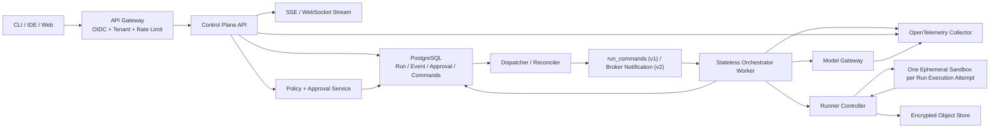

# ForgeReplay 生产级 Coding Agent 升级技术设计

> 文档状态：Proposal  
> 审查基线：`main@ca976eb83cc8a384ef59e9518ac722dd2d7d4ec2`  
> 当前版本：ForgeReplay v0.2.0  
> 目标：在保留现有 Durable Harness 核心语义的前提下，将单机作品集项目演进为可承载真实代码、真实用户和多 Worker 的生产级 Coding Agent 平台  
> 调研方式：当前代码与测试只读审计，并行完成分布式运行时、安全隔离、评测与生产运维三项专项 Review

## 1. 执行结论

ForgeReplay v0.2 已经不是一个简单的 Agent Loop。它已经具备事件账本、Checkpoint、稳定工具身份、审批指纹、预算预留、取消、租约、文件副作用对账、Shell 不确定状态和 Git Worktree 等可靠性基础。这些能力应作为生产版本的执行内核继续保留。

但它目前仍然是**单机、单用户、CLI 驱动的 Durable Coding Agent Harness**，不能称为生产级 Coding Agent。主要阻断项位于内核外围：

1. 模型生成的进程仍在宿主账户权限下运行，Worktree 不是安全沙箱。
2. SQLite、本地 Blob 和本机绝对路径不能支持跨 Worker 恢复。
3. Lease 已有 fencing epoch，但执行期写事务没有全部使用 epoch 做 Compare-and-Swap，仍存在旧 Worker 写入风险。
4. 没有认证、多租户、异步 API、持久队列、远程 Worker、对象存储和生产级审批入口。
5. 没有模型路由、Token/美元成本账本、OpenTelemetry、SLO、告警和 Runbook。
6. 当前 8 个 Held-out Task Cluster 只能证明评测链路有效，不能代表生产质量覆盖。

生产化的唯一主路线是：

```text
单机一致性加固
    -> 本地 gVisor 隔离与最小安全/成本/运维基线
    -> PostgreSQL 控制面、对象存储与认证租户边界
    -> 远程 Worker、Workspace 恢复和生产策略
    -> 可观测性、持续评测、灰度和灾备
```

在隔离 Runner、凭证分离、对象级授权和租户边界通过验收前，只允许内部、单租户、可信仓库验证，不能向外部用户开放不可信仓库。

近期不建议直接把整个系统迁移到 Temporal，也不建议先做多 Agent DAG。前者会引入第二套历史事实源，后者会在安全、成本和调度边界尚未完成时放大系统复杂度。

## 2. “生产级”的定义

本项目只有同时达到下面五类条件，才可以对外称为生产级 Coding Agent：

### 2.1 Harness 正确性

- Worker 崩溃、租约接管、重复消息和恢复不会产生不可解释的重复副作用。
- 模型、工具、审批、预算和取消均具有可持久化、可恢复的状态。
- 能安全自动恢复的动作自动恢复；无法证明结果的动作进入 `NEEDS_ATTENTION`，不盲目重放。
- 终态单调，旧 Worker 无法把完成或取消的 Run 重新变回 Active。

### 2.2 安全边界

- 策略禁止不可信仓库、测试和模型生成代码访问宿主、其他租户、控制面凭证或云元数据，并通过版本化攻击集、Runtime Attestation 和独立安全评审验证。
- 默认断网、最小权限、按 Run 隔离和资源硬限制；承认 Sandbox/Hypervisor 漏洞、配置错误与硬件侧信道仍是残余风险。
- Git Push、发布、长期凭证和高风险外部操作位于可信边界，不在 Agent Sandbox 中执行。

### 2.3 服务可靠性

- API、数据库、队列、Worker、Sandbox、对象存储和模型供应商均有明确故障语义。
- 有 SLI/SLO、错误预算、告警、Runbook、备份恢复和灰度回滚流程。
- 在明确的同步提交故障域内定义已确认事件 RPO，并分别定义 Event、Artifact 和审计数据的 RPO/RTO；Worker 丢失后 Run 能在目标时间内恢复。

### 2.4 质量与评测

- Harness 正确性、Coding 能力、安全、性能和用户体验分层评测。
- Release Candidate 在冻结任务集、故障注入、安全攻击集和 Soak Test 上通过门禁。
- “Run 正常结束”和“代码通过验证”严格区分。

### 2.5 经济可控性

- 模型调用、Token、费用、Sandbox 资源和 Artifact 存储全部可归属、限额和审计。
- 预算超限后不再产生新的收费调用。
- 能计算每个成功任务的成本，而不是只记录模型调用次数。

## 3. 当前能力基线

| 领域 | v0.2 已实现 | 证据 | 生产差距 |
|---|---|---|---|
| Durable Ledger | SQLite WAL、`synchronous=FULL`、迁移、类型化事件、Payload Hash | `src/forge_replay/persistence/` | 单机数据库、明文内容、无租户和高可用 |
| 恢复 | Projection、Checkpoint、损坏回退、tail replay | `runtime/checkpoint.py`、`persistence/store.py` | Runtime 热路径尚未默认使用 Checkpoint |
| Tool Identity | UUIDv7、Canonical Args、Approval Fingerprint、唯一约束 | `runtime/tool_identity.py` | 尚未成为跨服务协议 |
| File Effects | 原子写、Before/After Hash、崩溃对账 | `tools/file_tools.py`、`runtime/file_executor.py` | 仅本机文件系统 |
| Process Effects | argv-only、超时、输出上限、进程树终止、`UNCERTAIN` | `tools/process_supervisor.py`、`runtime/shell_executor.py` | 明确不是 OS Sandbox |
| Governance | 审批、Budget Reserve/Settle、取消、Lease/Fencing | `persistence/store.py` | Actor 未认证，Budget 维度不足，Fencing 未覆盖每次写 |
| Workspace | Worktree、Dirty Checkout 拒绝、路径防逃逸、结果导出 | `workspace/` | 与宿主同账户、共享 Git Common Dir、本地路径无法跨节点 |
| Provider | Ollama 与 OpenAI-compatible、429/5xx 有界重试 | `runtime/ollama.py`、`runtime/openai_chat.py` | 无模型路由、熔断、价格版本和 Durable Model Attempt |
| Operations | start/resume/approve/cancel/status/trace/export CLI | `cli.py` | 无异步 API、认证、RBAC、SSE 和 Scheduler |
| Evaluation | 故障 A/B、Projection 微基准、24 题 16/8 任务集 | `eval/`、`benchmarks/results/` | Held-out 样本小、语言和真实仓库覆盖不足 |

### 3.1 必须保留的不变量

1. Tool Intent 先持久化，后执行副作用。
2. 文件工具通过目标内容 Hash 对账，不用“可能执行过”替代证据。
3. 任意 Shell 不宣称 exactly-once。
4. Checkpoint 是缓存，Event Stream 才是事实来源。
5. 同一逻辑 Tool Call、审批决定和预算 Reservation 具有稳定身份。
6. Queue 允许至少一次投递；重复投递不能产生第二个逻辑调用。
7. 不能安全恢复时明确停机，而不是为了自动化率冒险重试。

### 3.2 当前最高风险

#### 旧 Worker 仍可能写入

`acquire_run_lease()` 会递增 epoch，但 `append_event()`、Tool Attempt 完成、预算结算和 Run 终止等写入并没有全部携带当前 `lease_epoch`。可能发生：

```text
Worker A 获得 epoch=7
Worker A 阻塞在模型或工具调用
Lease 过期，Worker B 接管 epoch=8
Worker A 的旧请求返回
Worker A 仍然成功写入旧结果
```

这是生产化的第一个 P0，必须先于远程 Worker 解决。

#### 宿主直接执行不可信代码

`ProcessSupervisor` 只限制启动方式、时间和输出，不限制进程读取用户目录、访问网络或启动解释器。`WorkspacePathGuard` 只能保护 ForgeReplay 自己的文件工具，不能约束 `python -c`、PowerShell、Git、测试脚本和恶意依赖。

#### 本机路径成为领域状态

Run 中保存本机 Worktree 绝对路径；Blob、Patch 和日志也位于本机。Worker 更换或磁盘丢失后，新的 Worker 无法恢复这些资源。

## 4. 目标总体架构



### 4.1 组件职责

**API Control Plane**

- 认证、租户、Run 创建、查询、取消、审批和 Artifact 访问。
- 处理 API Idempotency Key。
- 不运行模型生成的代码，不持有长时间数据库事务。

**PostgreSQL**

- Run、Event、Tool、Approval、Budget、Command 和 Outbox 的一致性事实源。
- 所有执行状态推进在单个数据库事务中完成。
- 使用租户边界和 Row-Level Security 防御跨租户访问。

**Dispatcher / Reconciler**

- 扫描可运行、待重试、审批已通过或租约过期的 Run。
- 公平调度、配额、优先级、背压和孤儿状态对账。
- 不执行 Agent Loop。

**Orchestrator Worker**

- Claim Run，取得 Fencing Token。
- 从 Checkpoint + Tail Events 恢复状态。
- 调用 Model Gateway，生成 Tool Intent，推进 Durable State Machine。
- 不直接执行任意宿主进程。

**Runner Controller / Sandbox**

- 将 Tool Attempt 映射为一次性隔离 Job。
- 执行代码、测试和工具，生成带 Hash 的 Receipt。
- 每 Run 独立可写层，结束后整体销毁。

**Model Gateway**

- 模型路由、限流、熔断、Retry Budget、Fallback 和价格账本。
- 持有模型凭证；Sandbox 永远拿不到模型 API Key。

**Object Store**

- 保存 Prompt/Response 大内容、日志、Patch、测试报告和其他 Artifact。
- 数据库只保存 Hash、长度、分类、加密 Key 和对象引用。

Sandbox 不直接访问 Object Store、SCM 或 Model Provider。Runner Controller/受限 Sidecar 负责上传，对租户、对象名、大小、Hash、媒体类型和 Artifact Policy 做校验。确需预签名 URL 时只授权单个对象、单一方法、短 TTL 和硬性大小上限。

### 4.2 权威事实层级

- `run_events`：业务执行历史的权威事实。
- `runs`、`tool_calls`、`model_calls` 等：与事件同事务维护的 Operational Projection，必须可校验或重建。
- Lease、Heartbeat、Queue Claim：协调状态，不属于可重放业务历史。
- Object Store：正文和制品字节的权威存储；PostgreSQL 保存权威引用、Hash、长度和租户归属。
- Model Gateway：只返回 Routing/Usage Receipt；最终调用与成本状态由 Runtime 写入 Ledger，Gateway 日志不是第二账本。
- Queue：只负责唤醒，不定义 Run 状态。

## 5. 分布式一致性设计

### 5.1 Execution Context

所有 Worker 执行期业务写入必须携带：

```python
class ExecutionContext(BaseModel):
    tenant_id: str
    run_id: str
    worker_id: str
    lease_epoch: int
    expected_stream_version: int
```

事务内必须验证：

```sql
SELECT 1
FROM runs
WHERE tenant_id = :tenant_id
  AND run_id = :run_id
  AND lease_owner = :worker_id
  AND lease_epoch = :lease_epoch
  AND lease_expires_at > clock_timestamp()
  AND stream_version = :expected_stream_version
  AND execution_status = 'active'
FOR UPDATE;
```

验证、Projection 更新、Event 追加、Stream Version 增长和 Command/Outbox 写入必须在同一个事务内完成。影响行数不是 1 时，Worker 必须立即停止，不能继续派发副作用。

事务分三类，不能混用：

1. **Worker Mutation**：要求 Lease Token + Expected Stream Version。
2. **Control Command**：要求认证 Actor、对象级授权、Idempotency Key + Expected Stream Version，不要求 Worker Lease；适用于取消、审批和人工 Reconcile。
3. **Lease Heartbeat**：只 CAS Owner/Epoch/Expiry，不追加普通业务事件，也不增长业务 Stream Version。Takeover 可以单独形成审计事件。

### 5.2 租约和心跳

- TTL 初始建议 20–30 秒，Heartbeat 5–10 秒；最终值必须由故障恢复 SLO 和数据库负载共同验证。
- Heartbeat 使用独立协程，不能被模型调用或测试执行阻塞。
- 数据库时间是唯一租约时钟，不能使用 Worker 本地时钟判断所有权。
- 连续心跳失败后 Worker 不再发起新副作用。
- Worker 收到 `SIGTERM` 后进入 draining，不再领取新 Run。
- 审批等待时释放 Lease 并结束 Worker Task，不让 Pod 空等数小时。
- 审批等待超过阈值后生成 Workspace Snapshot 并销毁 Sandbox；恢复时重新验证 Base SHA、Workspace Root Hash、Policy Bundle 和 Approval Fingerprint。

### 5.3 Event Stream

当前 Event Sequence 以 Session 为范围，生产版改为 Run-local Stream：

```text
PRIMARY KEY (run_id, seq)
UNIQUE (event_id)
```

这样同一 Session 的多个 Run 不会争用同一个 `next_seq` 行。控制面事件与执行面事件都进入 Run Stream，但 Worker 写入必须记录 `writer_lease_epoch`。

### 5.4 Transactional Outbox

队列分两个演进阶段：

- **v1**：`run_commands` 本身就是 PostgreSQL Durable Queue，使用 `SKIP LOCKED` Claim；状态推进与 Command 插入同事务。Outbox 只服务 SSE 和外部集成。
- **v2**：引入 SQS/NATS 等 Broker 后，Outbox Publisher 将通知投递到 Broker；Broker 消息仍只负责唤醒。

必须接受以下事实：

- Queue 消息可能重复、延迟或乱序。
- Queue 只负责唤醒，不负责定义状态真相。
- Worker 收到消息后仍需在 PostgreSQL 中 CAS Claim。
- 外部 Broker 消息在 Worker 成功持久化 Claim/Command Consumed 后即可 ACK，Run 后续恢复不依赖该消息一直在途。
- Dispatcher 还要周期扫描数据库，不能只依赖 `LISTEN/NOTIFY`。

第一版推荐 PostgreSQL `FOR UPDATE SKIP LOCKED` 作为 Run Queue；规模上升后可以替换为 SQS、NATS JetStream 等，但不改变上面语义。[PostgreSQL SELECT](https://www.postgresql.org/docs/current/sql-select.html)

#### Scheduler、容量与背压

- 采用按 Tenant 权重的公平队列，分别限制 Tenant/User/Repository/Model/Sandbox Pool 的 queued 与 active 数量。
- 相同 Repository/Branch 的写任务默认串行；只有独立分支、独立 Sandbox 且不会自动合并时才并行。
- 高风险 Run 使用独立 Worker Pool，不能占用普通任务全部容量，也不能降级到弱隔离 Pool。
- 扩容主要观察 `queue.oldest_age`、`runnable_runs_per_worker` 和 Sandbox Provision Capacity，CPU 只作辅助信号。
- Provider RPM/TPM、Sandbox CPU/Memory 和美元/小时预算任一触顶时，准入层必须背压，不能把压力转成无界 Retry。

容量基线按以下约束分别计算并取最小值：

```text
平均在途 Run ≈ 到达率 × 平均 Run 时长
模型容量 = min(RPM / 每 Run 调用数, TPM / 每 Run Token)
Sandbox 容量 = 可用 CPU/Memory/Disk / 单 Run P95 资源
```

### 5.5 Tool Attempt 与 Sandbox Job

Sandbox 与工具执行使用两层身份：

```text
sandbox_execution_id = run_execution_attempt_id
exec_request_id = tool_attempt_id
```

一个 Run Execution Attempt 使用一个可重连 Sandbox，多个 Tool Attempt 共享其中的可写 Workspace。同一个 `tool_attempt_id` 在 Sandbox 中最多对应一次物理执行。Worker 接管时优先重连现存 Sandbox；无法重连时，从最新 Workspace Snapshot 恢复。长期审批等待必须 Snapshot 后销毁 Sandbox。

Job 状态：

```text
REQUESTED -> STARTING -> RUNNING
                         |-> SUCCEEDED
                         |-> FAILED
                         |-> LOST
                         |-> CANCELLED
```

如果每个 Run Execution Attempt 使用 Kubernetes Job，应设置 `restartPolicy: Never` 和 `backoffLimit: 0`。非幂等动作的重试决策必须由 ForgeReplay 做出，不能让 Kubernetes 与 Harness 两层同时自动重试。[Kubernetes Jobs](https://kubernetes.io/docs/concepts/workloads/controllers/job/)

数据库 Fencing 只拒绝旧 Worker 提交状态，不能自动终止已经派发的外部动作。Runner Controller 必须对 `(tenant_id, run_id, sandbox_execution_id, lease_epoch)` 做 CAS；接管前查询、终止或 Reconcile 旧 Sandbox，并撤销旧 Epoch 的 Egress Capability 和短时凭证。仍无法证明结果时保持 `UNCERTAIN`，不宣称 exactly-once。

### 5.6 Model Attempt

Provider 内部 `sleep` 重试需要提升到 Durable Runtime：

- `model_calls` 保存一个逻辑调用。
- `model_attempts` 保存每次 Provider 请求。
- 持久化 Provider Request ID、状态码、`Retry-After`、Token Usage 和错误分类。
- 重试通过 `available_at` 调度，而不是阻塞 Worker。
- 一个 Agent 推理步骤只创建一个稳定 `model_call_id/model_decision_id`。Provider Retry 和 Model Fallback 都是它下面不同的 `model_attempt`；新推理轮次才创建新逻辑调用。
- Provider 支持幂等键时使用稳定 `model_call_id`。
- 无法证明模型是否已消费请求时记录 `UNCERTAIN_COST`，按预算上界处理。

### 5.7 Checkpoint 和 Prompt Working Set

生产版 `load_projection()` 默认读取最新兼容 Checkpoint，再读取 `after_seq` Tail Events。Checkpoint 需要固定：

- Runtime Code Version
- Reducer Version
- Prompt Version
- Policy Version
- Tool Registry Version
- `through_seq`
- Snapshot Hash

长 Run 不应每轮加载所有 Event 和 Blob 再截取最后几条，应单独维护 Prompt Cursor、Working Set 和可审计的 Summary。版本不兼容或 Hash 不匹配时继续全量事件重放。

## 6. PostgreSQL 与对象存储模型

### 6.1 推荐核心表

```text
tenants
users
repositories
runs
run_events
run_commands
run_outbox
tool_calls
tool_attempts
model_calls
model_attempts
approvals
capability_grants
budget_reservations
checkpoints
artifacts
artifact_refs
sandbox_jobs
worker_registry
api_idempotency_keys
price_books
```

### 6.2 Run 版本固定

每个 Run 创建时必须固定：

```text
runtime_version
event_schema_version
prompt_version
tool_registry_version
policy_version
routing_policy_version
model_provider/model/version
price_book_version
sandbox_image_digest
evaluator_catalog_version
```

已经开始的 Run 继续使用原版本。新发布只影响新 Run，不能在恢复时悄悄更换 Prompt、模型或工具语义。

### 6.3 Artifact 提交流程

对象 Key 在租户边界内采用内容寻址，默认关闭跨租户去重：

```text
<tenant_id>/sha256/ab/cd/abcdef...
```

安全发布流程：

1. 上传临时对象。
2. 校验 SHA-256 和长度。
3. 通过条件写发布内容寻址对象。
4. 数据库事务写 Artifact 元数据、Tenant/Run Reference 和对象授权。
5. 后台清理临时对象和无引用孤儿。

禁止数据库先引用一个尚不存在的对象。下载必须校验 Tenant、Run 和 Artifact Reference，不能只凭可猜对象 Key；预签名 URL 必须短时、单操作且不可跨租户复用。对象上传成功、数据库失败只会留下可回收孤儿；反向顺序会产生悬空引用。[S3 Conditional Writes](https://docs.aws.amazon.com/AmazonS3/latest/userguide/conditional-writes.html)

### 6.4 SQLite 迁移

当前规模适合离线迁移，不建议一开始做双写：

1. SQLite Exporter 导出 Canonical NDJSON 和 Blob。
2. 保留 Event ID、时间、Payload、Hash 和 Base SHA。
3. 将 Session Sequence 映射成每 Run Sequence。
4. 导入 PostgreSQL 后全量重建 Projection。
5. 对比 Event 数、Run 终态、Tool 状态和 Blob Hash。
6. 切换期间冻结旧 SQLite 写入。
7. 原库只读保留一个发布周期。

Schema 迁移使用 expand/contract；Event Payload 只新增可选字段或增加新版本，不原地修改已发布事件。

### 6.5 Workspace Snapshot 与跨 Worker 恢复

远程 Patch 和日志不足以恢复 Shell 产生的任意文件变化。每个稳定 Tool 边界必须生成 Workspace Tree Manifest：

```text
base_commit_sha
parent_snapshot_id
path
file_type
mode
content_sha256 / symlink_target
deleted_tombstone
workspace_root_hash
```

- 小文件进入 Tenant-scoped CAS，大文件按块上传并设总量上限。
- Runner Controller 持有可重连 Sandbox Handle；Worker 接管时先查询现存 Sandbox。
- Sandbox 已丢失时，从 Base SHA + 最新 Snapshot/Tree Manifest 重建。
- Shell/测试完成后由 Runner 在可信边界扫描完整文件树差异，不能只相信 Agent 自报 changed files。
- Snapshot Commit、Artifact Reference 和 Tool Receipt 必须按协议排序，避免引用半成品。
- 若崩溃发生在外部动作已执行而 Snapshot/Receipt 未确认的窗口，继续使用 `UNCERTAIN`/Reconcile 语义。

## 7. Sandbox 与不可信代码执行

### 7.1 威胁模型

需要假设以下输入都不可信：

- 仓库 README、Issue、代码注释和测试输出中的 Prompt Injection。
- 恶意依赖、安装脚本、编译器插件和测试代码。
- 被诱导或产生幻觉的模型。
- 恶意租户、被接管账户或被攻陷 Worker。

需要保护：源代码、宿主机、其他租户、Git/云/模型凭证、控制面数据库、模型费用、Artifact 和审计记录。

典型攻击包括：

- 读取 `.ssh`、云凭证、用户目录或云元数据并外传。
- 端口扫描、攻击内网、反向连接。
- Fork Bomb、内存/磁盘耗尽、挖矿。
- 利用 Git Common Dir、HostPath、Docker Socket 或设备逃逸。
- 伪造审批、复用过期授权或在审批后替换参数。

### 7.2 Execution Provider 分级

```python
class ExecutionProvider(Protocol):
    def provision(self, spec: SandboxSpec) -> SandboxHandle: ...
    def execute(self, handle: SandboxHandle, request: ExecRequest) -> ExecReceipt: ...
    def collect_artifacts(self, handle: SandboxHandle) -> ArtifactEnvelope: ...
    def terminate(self, handle: SandboxHandle, reason: str) -> TerminationReceipt: ...
    def destroy(self, handle: SandboxHandle) -> DestructionReceipt: ...
```

| 等级 | 场景 | Provider | 生产多租户判断 |
|---|---|---|---|
| D0 | 本地开发、可信仓库 | 当前 Host Process | 不允许 |
| S1 | 单租户内部任务 | Rootless OCI + gVisor | 条件允许 |
| S2 | 中等风险多租户 | Kubernetes + gVisor/Kata | 推荐起点 |
| S3 | 公开用户或高敏感代码 | Firecracker/独立 VM | 强隔离推荐 |

当前 Provider 应明确改名为 `UnsafeHostExecutionProvider`。生产配置若选择它必须启动失败，而不是只打印警告。配置 RuntimeClass 并不足够：Runner 必须回传并校验实际 Runtime Handler、镜像 Digest、RootFS、Seccomp、Capabilities、cgroup 和 Network Namespace；Runtime/CNI/策略缺失时 Fail-closed，禁止回退普通容器。

gVisor 通过独立应用内核减少不可信进程直接接触宿主 Linux Kernel 的攻击面，适合与 OCI/Kubernetes 集成，但仍需要网络、资源和租户隔离的纵深防御。[gVisor Security Model](https://gvisor.dev/docs/architecture_guide/security/)

Firecracker 提供硬件虚拟化边界。生产部署必须启用 Jailer、Seccomp、独立低权限 UID/GID 和 cgroup 资源限制；官方也建议每个 Firecracker 进程只承载单一租户工作负载。[Firecracker Production Host Setup](https://github.com/firecracker-microvm/firecracker/blob/main/docs/prod-host-setup.md)

### 7.3 Linux Sandbox 基线

每个 Run 必须：

- 非 Root UID/GID，`no_new_privileges`，Drop 全部 Capability。
- RootFS 只读，`/workspace` 为容量和 inode 有上限的临时可写层。
- 独立 PID、Mount、IPC、User、UTS 和 Network Namespace。
- 禁止 HostPath、Docker/Container Runtime Socket 和任意设备。
- 使用 Seccomp + AppArmor/SELinux + gVisor/微虚拟机纵深防御。
- cgroup v2 限制 CPU、内存、PID、I/O。
- 默认断网；完成后销毁整个 Sandbox，而不是只删除 Worktree。
- 不挂入用户原仓库或 Git Common Dir。

### 7.4 Repository Fetcher 与 Publisher

Sandbox 不直接持有 GitHub/GitLab 长期 Token：

1. 受限 Fetcher 以精确 Commit SHA 和单仓库、只读、短 TTL 凭证获取仓库。
2. 校验仓库大小、文件数、LFS、Submodule 和对象完整性。
3. 生成不含宿主 Git Common Dir 的只读源快照。
4. Sandbox 内复制到临时可写 Workspace；需要 Git 时创建独立临时 Repo。
5. Sandbox 只输出 Patch、Manifest、测试报告和明确 Artifact。
6. 可信 Publisher 重新校验 Patch，经过策略或审批后创建分支/PR。

Git Push、PR、Release 和生产部署永远不作为普通 Sandbox 工具。

Fetcher 必须禁用 Git Hooks、Credential Helper 和宿主 Git 配置继承；默认禁止 Submodule/LFS，或单独审批 URL、协议和域名；禁止 `file://`、本地路径、任意 SSH 和协议扩展，并限制 Pack 大小、文件数、压缩展开比、历史深度和总字节。依赖获取只允许 Lockfile 声明且通过策略的制品。

### 7.5 网络策略

默认 `network_mode=none`。需要依赖下载时优先拆成可信 Fetch 阶段，实际代码执行阶段离线。

确需联网时：

- 只能经过 Egress Proxy。
- 按域名、端口和协议授权；只有终止 TLS 的 L7 Proxy 才能可靠约束 HTTP 方法。
- Sandbox 自身 Network Namespace 内的 Loopback 可按任务需要使用，但必须阻断宿主/节点本地服务、RFC1918、Link-local、云元数据和 Kubernetes API。
- 校验 IPv4、IPv6、IPv4-mapped IPv6、CNAME 链和每次重解析结果，连接阶段再次验证地址以防 DNS Rebinding。
- 限制连接、请求、字节和速率并记录审计。

Kubernetes `NetworkPolicy` 只能作为 L3/L4 基线，而且依赖网络插件真正执行策略，不能替代 FQDN/HTTP Egress Proxy。[Kubernetes Network Policies](https://kubernetes.io/docs/concepts/services-networking/network-policies/)

### 7.6 凭证

- 模型 Key 只存在于 Model Gateway。
- SCM Token 只存在于 Fetcher/Publisher。
- 优先由可信代理代为访问下游系统；Sandbox 若确需凭证，只获得短 TTL、最小 Scope、可撤销的一次性 Lease。
- 凭证不进入模型上下文、命令参数、Event、Trace、Patch 或 Artifact。
- Run 结束或取消立即撤销。
- 使用 Canary Credential 测试外传防护。

Vault 的动态凭证和 Lease/Revoke 模型可作为 Credential Broker 实现之一。[Vault Secrets Engines](https://developer.hashicorp.com/vault/docs/secrets)

短时凭证只缩短暴露窗口，不能阻止恶意进程在有效期内外传，因此不是 Sandbox 和 Egress Policy 的替代品。

### 7.7 Windows 与 Linux 生产边界

- 首期生产执行面只支持 Linux；当前 Windows Host Process 只用于本地开发。
- Windows 专属构建若未来开放，使用 Windows Server + Hyper-V Isolated Container，以 `ContainerUser` 运行。
- 禁止宿主可写目录、Named Pipe、Docker Pipe、长期凭证和默认网络。
- Windows Process-isolated Container、WSL2 和 Docker Desktop 不作为敌对多租户安全边界。
- Windows Sandbox 不作为多 Worker 服务端调度底座。

## 8. 策略、审批和多租户

### 8.1 Policy Evaluator

策略决策必须与模型分离。建议先定义 OPA-compatible 接口，是否部署独立 OPA 可后续决定。Policy Service 不可用时 Fail-closed；本地缓存只能使用带签名、固定 Digest、有效期和撤销版本的 Policy Bundle。

输入至少包含：

```json
{
  "principal": {"tenant_id": "t-1", "user_id": "u-1", "roles": ["developer"]},
  "run": {"run_id": "r-1", "base_sha": "...", "sandbox_image_digest": "sha256:..."},
  "tool": {"name": "run_process", "argv": ["pytest", "-q"], "cwd": "."},
  "requested_capabilities": {"network": [], "filesystem": ["workspace:rw"]},
  "policy_bundle_digest": "sha256:..."
}
```

输出：`allow`、`deny` 或 `require_approval`，并带约束、原因、到期时间和 Policy Version。

### 8.2 工具风险分级

- 默认允许：Workspace 内只读文件与受限搜索。
- 可自动允许：无网络、固定可执行文件和参数 Schema 的测试/Lint/格式化。
- 需要审批：安装依赖、修改 Lockfile、外网访问、新增可执行文件。
- 默认拒绝：Git Push、SSH、云 CLI、Docker/Kubernetes Socket、宿主路径、服务管理、任意解释器内联脚本。

### 8.3 审批证明

审批不再接受任意 `--actor` 字符串，必须来自 OIDC 认证主体。审批指纹绑定：

- Tenant、User、MFA 状态。
- Base SHA、Sandbox ID、镜像 Digest。
- Tool 名称、版本、Canonical Args、CWD。
- 文件 Diff 摘要、网络 Capability。
- Policy Bundle Digest、有效期和一次性 Nonce。

审批页面用确定性代码渲染真实参数，不能只显示模型生成的自然语言摘要。任何字段变化都使审批失效。明确风险规则必须强制双人审批；撤销只影响尚未派发动作，不能撤回已经发生的副作用。

### 8.4 多租户数据边界

- 所有业务表增加 `tenant_id`，唯一约束包含租户范围。
- Repository 层每个查询强制 Tenant Context。
- PostgreSQL 启用并强制 RLS；应用角色不能是表 Owner、Superuser 或 `BYPASSRLS`。
- 对象存储使用租户前缀和租户级 KMS Key。
- 队列消息携带签名 Tenant/Run Context。
- 可写 Workspace、Secret Lease、模型会话和可写缓存不得跨租户复用。
- API 逐对象验证用户—Tenant—Repository 成员关系，以及 Run/Event/Approval/Artifact 权限；OIDC 身份本身不等于对象授权。
- SCM App 安装范围必须校验，防止 Confused Deputy；SSE/WebSocket 重连重新授权。
- 审批具备 Anti-CSRF、Replay Protection 和 MFA 新鲜度检查。
- Worker 从数据库读取权威授权上下文，队列中的签名 Tenant Context 仅用于完整性校验。

[PostgreSQL Row Security](https://www.postgresql.org/docs/current/ddl-rowsecurity.html) 可以作为数据库层纵深防御，但不能取代应用授权测试。

## 9. Model Gateway 与成本治理

### 9.1 路由与故障策略

Model Gateway 负责：

- 根据任务类型、上下文、风险、预算和 Provider 健康度选择模型。
- 持久化路由输入、策略版本、最终模型和降级原因。
- Provider/Model 级 RPM、TPM、并发限制和熔断。
- 指数退避 + Jitter，并设置全局 Retry Budget。
- Retry 和 Fallback 都创建同一逻辑 Model Call 下新的 `model_attempt`，不静默覆盖既有 Attempt；只有新的 Agent 推理轮次才创建新逻辑 Model Call。
- 检查 Fallback 模型的上下文窗口和工具 Schema 能力。
- 记录 Tenant 允许的 Provider、区域、数据驻留、Zero-retention/No-training 合同属性和版本。
- 发送前执行 Secret/PII/源码分类与 DLP；Fallback 不得进入 Tenant 未授权 Provider 或区域。
- 高敏感 Tenant 支持私有模型或完全禁止外部 Provider。

### 9.2 预算维度

在现有 `model_calls` 基础上增加：

```text
input_tokens
cached_input_tokens
output_tokens
model_cost_usd
tool_cpu_seconds
sandbox_wall_seconds
artifact_bytes
network_egress_bytes
```

预算覆盖 Run、用户、团队、日和月。模型调用前按最坏输出 Token 预留，完成后按实际 Usage 结算。

Budget Reservation 增加：

- `reservation_expires_at`
- `released` / `uncertain` 状态
- Reconciler 处理过期 Reservation
- Usage 不可确认时按保守上限结算，不能直接退款

生产验收要求 100% 已完成模型调用可以关联到 Tenant、Run、Provider、Model 和 Price Book Version。

## 10. API 与用户体验

### 10.1 最小 API

| API | 核心语义 |
|---|---|
| `POST /v1/runs` | 使用 `Idempotency-Key`，异步返回 `202` 和 `run_id` |
| `GET /v1/runs/{id}` | 状态、Phase、预算、验证结果和下一步 |
| `GET /v1/runs/{id}/events` | Cursor 分页 |
| `GET /v1/runs/{id}/stream` | SSE/WebSocket 增量事件 |
| `POST /v1/runs/{id}/cancel` | 幂等取消，区分“已接收”和“Sandbox 已终止” |
| `GET /v1/approvals` | 按用户、团队、风险和等待时间查询 |
| `POST /v1/approvals/{id}/decision` | Fingerprint + Version 防陈旧审批 |
| `POST /v1/tool-attempts/{id}/reconcile` | 人工处理不确定外部动作 |
| `GET /v1/runs/{id}/artifacts` | Patch、测试、Manifest 和验证证据 |
| `POST /v1/runs/{id}/retry` | 创建带 `parent_run_id` 的新 Run，不改写失败历史 |

错误响应区分：用户输入、配额不足、安全拒绝、Provider 故障、Harness 故障和基础设施故障。

### 10.2 审批体验

审批 UI 至少展示：

- 确切命令、CWD、文件 Diff、网络目标和预计成本。
- 风险等级与触发规则。
- 授权范围和过期时间。
- 允许、拒绝、撤销、取消和转交。
- 决策后自动唤醒 Run，不要求用户再次手动 Resume。

## 11. 可观测性、SLO 与运维

### 11.1 三类事实不能混用

- Event Ledger：恢复和审计的事实来源。
- Trace/Log：跨服务诊断。
- Metric：聚合、容量和 SLO。

OpenTelemetry 不能替代 Event Ledger。GenAI 语义约定仍在演进，接入时应锁定版本，默认不采集 Prompt、Tool 参数和 Completion 正文。[OpenTelemetry GenAI Spans](https://github.com/open-telemetry/semantic-conventions-genai/blob/main/docs/gen-ai/gen-ai-spans.md)

### 11.2 Span 树

```text
POST /v1/runs
└── invoke_agent
    ├── acquire_run_lease
    ├── restore_checkpoint
    ├── provision_sandbox
    ├── chat <model>
    │   └── provider_attempt
    ├── execute_tool <tool_name>
    │   └── sandbox_process
    ├── approval.requested
    ├── verify_result
    └── export_artifact
```

人工等待不保持一个跨小时的打开 Span。`approval.requested` 与后续 `approval.decided` 使用 Span Link/Log 关联，等待时长从 Ledger 时间戳计算。`run_id`、`user_id`、仓库 URL 和 Commit SHA 不作为 Metric Label，只进入受控 Trace/Log；Collector 还要限制 Attribute 大小并二次脱敏。安全审计与普通 Trace 分库存储。

### 11.3 核心指标

| 指标 | 类型 | 主要维度 |
|---|---|---|
| `forge.run.count` | Counter | release、terminal_class、tenant_tier |
| `forge.run.duration` | Histogram | task_class、model_family、result |
| `http.server.request.duration` | Histogram | route_template、method、status_class |
| `forge.queue.depth` | Gauge | priority、worker_pool |
| `forge.queue.oldest_age` | Gauge | priority、worker_pool |
| `forge.enqueue_to_start.duration` | Histogram | priority、worker_pool |
| `forge.outbox.oldest_age` | Gauge | destination |
| `forge.worker.count` | Gauge | pool、state |
| `forge.sandbox.provision.duration` | Histogram | provider、result |
| `forge.model.call.duration` | Histogram | provider、model、result |
| `gen_ai.client.token.usage` | Histogram | provider、model、token_type |
| `forge.tool.duration` | Histogram | tool_name、effect_class、result |
| `forge.approval.wait.duration` | Histogram | risk_level、decision |
| `forge.budget.cost` | Counter | provider、model、tenant_tier |
| `forge.lease.takeover.count` | Counter | reason |
| `forge.safety.denied.count` | Counter | policy_rule、risk_level |
| `forge.budget.reservation.age` | Histogram | category、state |
| `forge.artifact.operation.duration` | Histogram | operation、result |

每项 Metric 还需在实现时固定单位、Histogram Bucket、基数上限、采集点和 Owner。财务报表以 Cost Ledger 为事实源，Metric 只用于近实时运营。

### 11.4 初始 SLO、控制指标与安全不变量

真正可消耗错误预算的 Operational SLO：

| SLI | 可执行口径 | Beta | GA |
|---|---|---:|---:|
| API 可用率 | 28 天内 eligible 请求中非平台 5xx/容量故障 429 的比例；用户输入 4xx、用户取消、租户硬配额 429 排除 | 99.5% | 99.9% |
| 排队时延 | 已通过准入、普通优先级 Run 从 enqueue 到第一个有效 Lease 的 P95；负载不超过声明的并发/队列容量 | <60 秒 | <30 秒 |
| Run 终态时效 | 无人工等待、任务未超出声明墙钟上限的 eligible Run，在时限内进入终态的比例；按 Harness/Provider/Quality 终态分层 | 99.5% | 99.9% |
| Worker 故障恢复 | 从 Worker Registry 确认失联或 Lease 到期，到新 Worker 取得 Lease 并完成第一个状态推进的 P95 | <60 秒 | <45 秒 |
| 取消确认 | API 接收取消到 Durable Command 提交 P95 | <2 秒 | <1 秒 |
| 取消执行 | Durable Cancel 到 Sandbox 确认终止 P95 | <15 秒 | <10 秒 |
| 事件流新鲜度 | Event Commit 到已连接 SSE Client 可见 P95 | <5 秒 | <2 秒 |
| 审批生效 | Approval Commit 到 Run 重新进入可调度状态 P95 | <5 秒 | <2 秒 |

每个 SLI 的实现规格必须固定统计对象、分子、分母、观察窗口、排除项、数据源和 Owner。模型未修好 Bug 属于 Verification Quality；Provider Failure 与 Harness Internal Failure 单独分层，不能混进“已到终态”。

下面是不允许用错误预算消耗的 Safety/Consistency Release Invariant：

- 已确认 Event 在声明同步提交故障域内丢失：0/N。
- 可重放文件工具重复物理副作用：0/N。
- Stale Worker Post-fence 数据库写入：0/N。
- Stale Epoch 未经 Reconcile 的外部副作用：0/N。
- 跨租户对象访问成功：0/N。
- Canary Credential 外传成功：0/N。

有限测试只能报告覆盖范围和分母，不能证明数学上永远为零。成本归属率是账务对账控制指标：Beta >99.5%，GA 100%。这些均是未来目标，不是当前实测结果。

### 11.5 P0/P1 告警

- P0：任意跨租户访问、Sandbox Escape Signal、Canary 凭证外泄、重复外部副作用或已确认事件丢失。自动冻结新 Run、关闭相关 Tool、撤销凭证并切换只读。
- P1：GA 可用性 SLO 在 5 分钟窗口 Burn Rate >14.4 且 1 小时窗口 >6，或 30 分钟 >6 且 6 小时 >1；普通队列 `oldest_age` 连续 10 分钟 >30 秒；成本速率超过小时预算 120%；Lease Conflict >1%；`UNCERTAIN` 比率超过近 7 天同类基线三倍。
- Provider 原始 429/5xx 先触发限流、熔断和合规 Fallback；只有影响用户 SLO、Queue Age 或错误预算时才 Page。
- Ticket：审批等待过长、Artifact 清理积压、预算 Reservation 超过 TTL 或低频单 Run 失败。

每个告警规格必须包含 Owner、数据源、窗口、阈值、去重键、自动恢复条件和 Runbook：影响判断、只读检查、自动止损、回滚、数据一致性验证和复盘入口。

## 12. 数据保护与审计

### 12.1 不可变元数据 + 可删除正文

Event 只保存 Hash、长度、分类、加密对象引用和审计字段。Prompt、Completion、源码、Tool Output 和 Artifact 放对象存储。

Active、Waiting Approval、Retryable、`NEEDS_ATTENTION` 和 Legal Hold 中的 Run 不得删除恢复所需 Prompt、模型响应、Tool Output、Receipt 或 Workspace Snapshot。只有终态且超过恢复/申诉窗口的内容才能删除；删除时追加 Tombstone/`ContentDeleted` 事件并保留原 Hash，同时设置 `replay_capability=metadata_only`。此后只支持审计验证，不再承诺 Replay/Retry。

`POST /retry` 若依赖旧输入，必须在删除前将必要输入复制到新 Run。删除器校验 Artifact Reference 和 Legal Hold；对象按每 Run/对象 Data Key 做 Envelope Encryption，销毁 Key 形成 Cryptographic Erasure。备份恢复后必须重放 Tombstone，避免已删除正文重新出现。

### 12.2 防篡改审计

当前 `payload_sha256` 可检测意外损坏，但拥有数据库写权限的人可以同时修改内容和 Hash。生产审计增加：

```text
event_hash[i] = SHA256(event_hash[i-1] || canonical_event[i])
```

- `canonical_event` 固定版本，并包含 Event ID、Run/Seq、Schema Version、Payload Hash 和 Previous Hash。
- 运行中定期由 KMS 签署审计锚点，Run 完成后再签署 Root Hash，防止未完成 Run 尾部被静默截断。
- WORM/Object Lock 只保存审计 Root/元数据，不锁住依法需要删除的正文。
- 提供 `verify-audit` 离线验证工具。
- 所有审计读取和导出也记录审计事件。

### 12.3 初始保留建议

| 数据 | 默认保留 |
|---|---:|
| Run 元数据与成本账本 | 400 天 |
| Prompt/Completion/Tool 正文 | 30 天 |
| Patch、Artifact、完整日志 | 30 天，可配置到 90 天 |
| 安全与审批审计 | 400 天 |
| 聚合 SLO/容量指标 | 13 个月 |
| 调试级完整 Trace | 7 天 |

实际值由租户、区域和合规要求覆盖，不能硬编码。每类数据必须指定 Owner、删除 SLA、Legal Hold 流程和租户覆盖规则。

## 13. 供应链安全

- `uv.lock` 强制 `--locked`。
- 基础镜像使用 Digest，不使用浮动 Tag。
- 生成 SPDX/CycloneDX SBOM。
- 扫描依赖、OS 包、许可证和 Secret。
- Sandbox 镜像使用 Cosign 签名并在准入时验证。
- 生成 SLSA Build Provenance。
- 未签名、存在阻断级漏洞或 Provenance 不匹配的镜像拒绝调度。
- Sandbox 不允许自行拉取和运行未经校验的容器镜像。
- Worker/Runner 使用短时 Workload Identity 和最小 Kubernetes RBAC；禁止 Cluster Admin，Runner Controller 只接受签名且已授权的 Sandbox Spec。
- 维护 Runtime、宿主内核、微码和基础镜像的 CVE Patch SLA；Firecracker 路径必须启用 Jailer、Seccomp、cgroup、独立低权限 UID、网络过滤和 Snapshot 完整性校验。

## 14. 评测与发布门禁

### 14.1 Harness 正确性

- 对文件、进程、模型、审批和数据库的所有已知稳定 Crash Window 做确定性穷举，全部通过。
- 对 Worker Kill、Lease 过期、重复消息、数据库短暂失败和时钟偏移做随机/并发 Stress，保存次数、Seed、分层结果和置信上界。
- 状态迁移使用性质测试；关键状态机逐步引入模型检查。
- 随机测试至少覆盖 1,000 次故障注入与 10,000 次 Lease 接管，但报告必须写 `0/N` 和统计上界，不能把有限样本包装成数学证明。

### 14.2 Coding 能力

- 至少 200 个独立 Task Cluster。
- Python、TypeScript/JavaScript、Go、Java 等多语言。
- 小、中、大仓库分层。
- 覆盖单文件、多文件、测试、API、依赖、并发、性能和安全任务。
- 每个 Release Candidate 重复至少 3 次。
- 主指标为 `pass@1`/隐藏测试通过率，并报告 Task-level 分子分母和 Cluster CI。
- 预注册 Task Catalog、基线 Commit、Prompt/Tool/Policy 版本、模型 Snapshot 或 Alias、Sandbox Digest、Seed、超时、硬件等级、重复次数和执行顺序。
- Hosted Model 只能固定 Alias 时明确降级声明，不能承诺恢复时权重完全相同。

### 14.3 安全评测

- Prompt Injection、恶意仓库指令、路径穿越、命令注入。
- 凭证搜索/外传、网络扫描、依赖混淆和恶意构建脚本。
- 审批绕过、过期 Fingerprint、跨租户访问和 Sandbox 残留。
- 增加 DNS Rebinding、IPv6、Double-fork/`setsid`、对象存储越权、预签名 URL Replay、Fetcher 协议注入、Provider 越区和 Runtime Attestation。
- 使用无权限 Canary Credential，不把真实凭证放入攻击测试。
- Critical/High 攻击任何一次成功即阻断；其他检查使用预注册阈值，不能用总体平均分掩盖严重失败。

### 14.4 性能与稳定性

- Control Plane 在规划峰值的 1 倍和 2 倍压力测试；记录 API RPS、Run 到达率、Task 分布和数据库/Worker 规格。
- 参考场景：1,000 queued、20 active Sandboxes，并固定事件数、Tool/Model 比例、Stub 延迟、峰值与平均并发。
- 72 小时 Soak 至少执行 10,000 个 Run、100,000 次模型/Stub 调用、100,000 次工具调用，每小时注入 Worker Kill、Provider 限流或存储延迟；实际数字可在容量评审中上调，但不得只写持续时间。
- Provider 限流、数据库故障切换、对象存储变慢和 Worker 批量退出。
- 验证内存、数据库/对象存储增长、孤儿 Sandbox/Workspace、悬挂 Reservation、Outbox Lag、Queue Age 和 Worker Takeover 能回归稳态。

### 14.5 Release Gate

- 候选与固定基线按 Task Cluster 配对，`Δ = candidate pass@1 - baseline pass@1`，单侧 95% LCB 必须 `>= -0.02`；按语言、仓库规模和任务类型分层。
- 在相同负载与配对任务下，分别门禁 API、Queue、Sandbox Provision、Model 和端到端 Run P95；默认恶化不超过 15%。
- 同时门禁每次 Attempt 成本和每成功任务成本；后者要求预注册最小成功样本量，默认恶化不超过 10%。
- 任何质量/成本旁路必须由 Release Owner 与安全/质量 Owner 联合批准，记录最低收益、有效期和回滚条件。
- Critical/High 安全攻击成功次数为 0/N；其他安全检查按预注册阈值。
- 重复 replay-safe 文件副作用为 0。
- 72 小时 Soak 中没有 Run 丢失、预算失账或无法解释的所有权冲突。

当前 8 个 Held-out Cluster 的 14/24 结果继续作为 v0.2 基线，但因 Cluster 数量少、置信区间宽，不作为生产 SLO。

## 15. 灰度、回滚和灾备

### 15.1 灰度流程

```text
Deterministic Tests
 -> Fault/Security/200+ Task Regression
 -> Shadow（无真实副作用）
 -> Internal Tenant
 -> 1% Canary
 -> 5% -> 25% -> 50% -> 100%
```

发布单元包含 Runtime、Prompt、Model、Tool Schema、Policy、Sandbox Image 和 Price Book，不只是应用镜像。

每个 Canary 阶段同时要求最短观察时间和最低 Run/Task Cluster 数；低流量时不能只依靠“1% 流量”。质量、成本和故障结果按 Release/Prompt/Model/Policy Version 分组。

自动停止灰度条件：

- 错误预算快速燃烧。
- `UNCERTAIN` 或 Harness Internal Error 显著上升。
- 任意跨租户访问、Sandbox 逃逸或重复副作用。
- 成本率超过基线两倍。
- 质量低于预注册门禁。

回滚只影响新 Run；在途 Run 继续使用创建时固定的版本，或者显式取消。

### 15.2 灾备

- PostgreSQL 多可用区部署，定期 PITR 演练；“已确认”定义为 PostgreSQL Commit 已返回且达到部署声明的同步副本数。
- 在该主区域/AZ 同步提交故障域内，Event Metadata 目标 RPO 为 0；异步跨区域复制必须给出实测非零 RPO，不能沿用 0。
- Artifact Body 只有在对象上传、Hash 验证和所需复制完成后才能标记 Durable；Event Reference 不能先于该状态提交。
- 审计锚点、Policy Bundle、KMS Key/Wrap Key、Artifact Reference 和删除 Tombstone 必须纳入恢复计划。
- Beta RTO：从故障确认到可接受新 Run <1 小时；GA <30 分钟。历史 Run 全量恢复时间单独测量。
- 分别记录 Event Metadata、Artifact Body 和 Audit Anchor 的 RPO/RTO，并通过最后确认 Event ID/Artifact Hash 对比验证。
- 至少演练数据库切主、区域对象存储不可用、Worker 池丢失、Provider 故障和 KMS/Policy 恢复。

## 16. 分阶段实施路线

以下阶段是唯一实施顺序。P0–P2 只允许内部、单租户、可信仓库；P3 全部安全门禁通过后才允许外部 Beta 和不可信仓库。

### P0：生产契约与单机一致性加固

交付：

- `EventStorePort`、`BlobStorePort`、`RunQueuePort`、`RunnerPort`、`PolicyEvaluator`、`ExecutionProvider`。
- 所有 Worker Mutation 强制 `LeaseToken + expected_stream_version`；Control Command 与 Heartbeat 使用各自事务协议。
- Runtime 保存续租后的 Lease，独立 Heartbeat，不再丢弃 Epoch。
- Durable Model Attempt、Budget Reservation Reconcile、Checkpoint 热路径和 Prompt Working Set。
- 当前宿主执行器重命名为 `UnsafeHostExecutionProvider` 并限制为 Dev-only。
- 正式 Claims Matrix、Threat Model、版本固定和数据分类。

验收：

- 对全部已知 CAS/副作用 Crash Window 做确定性穷举。
- 10,000 次带 Seed 的 Lease Stress 中 Post-fence 数据库写入为 `0/N`，并报告统计上界。
- 所有缺少 Token 的 Worker Mutation 直接拒绝。
- 重复 Resume 不增加逻辑 Model/Tool Call。
- Checkpoint 确实用于 Runtime 恢复。

### P1：本地隔离执行与最小生产护栏

交付：

- gVisor `ExecutionProvider`、Runner Controller 与 Runtime Attestation。
- 每 Run Execution Attempt 一个 Sandbox，默认断网、只读 RootFS、临时 Workspace。
- cgroup CPU/内存/PID/I/O/磁盘限制，完成后销毁 Sandbox。
- 受限 Repository Fetcher/Publisher，模型和 SCM 凭证不进入 Sandbox。
- 最小 Policy Evaluator、无权限 Canary Credential 和 Artifact Scanner。
- Per-run 模型调用、Token、美元和墙钟硬上限；Provider 基础 RPM/TPM 限流。
- 最小 Dashboard、Kill Switch、P0 安全告警和核心 Runbook。

验收：

- Runtime Handler、镜像 Digest、Seccomp、Capabilities、cgroup 和 Network Namespace Attestation 全部匹配，缺失时 Fail-closed。
- Host Canary、用户目录、Canary Credential、宿主/节点服务和云元数据访问成功数为 `0/N`。
- 重复 Exec Request 不产生第二次物理执行；旧 Epoch Sandbox 被终止或进入明确 Reconcile。
- Sandbox 销毁后旧 Sandbox ID、Volume、Mount、进程、Network Namespace 和对象引用均不可访问；敏感临时数据通过每 Run Key 销毁实现 Cryptographic Erasure。
- 预算拒绝事务提交后不再成功派发新 Provider Attempt；在途/不确定调用按预留上界结算。

### P2：PostgreSQL 控制面、对象存储与认证边界

交付：

- PostgreSQL Schema、Run-local Stream、迁移工具和 SQLite Importer。
- 异步 REST API、SSE、OIDC、Tenant/RBAC、对象级授权和 API Idempotency。
- PostgreSQL `run_commands` Queue；Outbox 用于 SSE/外部集成。
- Tenant-scoped S3/MinIO 内容寻址存储、正文/元数据分离、Envelope Encryption。
- 短期 SCM Credential Broker、受限 Fetcher/Publisher、固定 Base SHA 源快照。
- Patch、日志、测试报告、Workspace Snapshot 和 Receipt 远程上传。
- 数据保留、删除 Tombstone、Legal Hold 和 Artifact GC。
- 基础 OpenTelemetry、Operational SLO、Burn Alert、备份恢复 Runbook。

验收：

- 10 个 Worker 并发处理 1,000 个 **Control-plane Synthetic Run**；固定事件数、Stub 延迟、并发和数据库规格，无 Run 丢失。
- 重复 API/Queue 请求返回同一 Run/Command，不产生重复逻辑调用。
- 数据库短暂重启后所有非终态 Synthetic Run 继续推进。
- Artifact Hash 匹配率 100%，跨租户对象访问和预签名 URL Replay 成功数为 `0/N`。
- 上传崩溃不产生被 Run 引用的半成品。
- 删除 Tombstone 在备份恢复后仍然生效。

### P3：分布式 Worker、Workspace 恢复与外部 Beta 安全门禁

交付：

- 多 Dispatcher、多 Stateless Worker、Capability Routing 和审批通过自动唤醒。
- 可重连 Sandbox Handle；每个稳定 Tool 边界生成增量 Workspace Snapshot/Tree Manifest。
- Worker 接管时优先重连，否则从 Base SHA + Snapshot/CAS 恢复完整 Workspace。
- OPA-compatible Policy、OIDC/MFA 审批、强制双人规则、Egress Proxy。
- Runner Epoch CAS、旧 Capability/Secret Lease 撤销、Post-fence 外部动作 Reconcile。
- 多租户 RLS、SCM App 安装范围、SSE 重授权和完整对象级授权测试。
- 72 小时 Soak、最小 On-call 轮值和公开 Beta Runbook。

验收：

- Worker Kill 后真实 Coding Run 能由另一 Worker 在 SLO 内继续；清空旧 Worker 磁盘不影响恢复。
- Base SHA、Workspace Root Hash、Snapshot Manifest 和 Artifact Hash 全部匹配。
- Post-fence 数据库写入和未经 Reconcile 的外部副作用均为 `0/N`。
- DNS Rebinding、IPv6、Double-fork、Fetcher 协议注入、对象越权、审批 Replay 和 Provider 越区攻击集通过。
- 在本阶段安全签字前，外部入口保持关闭；签字后才开放受控 Beta。

### P4：模型网关、完整 FinOps、持续评测与灰度

交付：

- 多 Provider 路由、限流、熔断、Retry Budget 和合规 Fallback。
- Tenant Provider/Region/Data-residency Policy、DLP 和 Price Book。
- Run/User/Team/日/月多层预算和完整成本 Dashboard。
- 200+ Task Cluster、多语言、安全、容量和 72 小时 Soak 评测。
- Shadow/Canary、自动停止和质量/延迟/成本联合门禁。

验收：

- 100% 已完成模型 Attempt 可归属和结算。
- Provider/Model/时间窗内 `retry_attempts / initial_attempts` 不超过预注册 Retry Budget，同时限制重试 Token 和美元。
- 429/5xx 演练不产生重试风暴或未授权 Provider Fallback。
- 预算拒绝后不再成功派发新 Provider Attempt。
- 满足第 14 节全部发布门禁。

### P5：GA 高可用运营与高强度隔离

交付：

- 多可用区控制面、完整 On-call、Runbook、容量、数据生命周期和灾备。
- Firecracker/Kata 高风险 Provider 与独立节点池。
- 租户自助配额、成本、删除、导出和审计。
- SBOM、Cosign、SLSA、审计哈希链、KMS Anchor 和 WORM 元数据。
- 独立安全评审、渗透测试、CVE Patch SLA 和 Runtime 升级流程。

验收：

- 连续 28 天达到 GA Operational SLO。
- 完成数据库、KMS、Policy、Worker、Provider 和区域对象存储灾难演练。
- 所有 Page 告警关联可执行 Runbook 和自动止损。
- 无未归属成本、孤儿 Sandbox/Workspace、悬挂预算和超期敏感正文。
- 公开敌对多租户只调度到已批准的强隔离 Tier。

## 17. 推荐提交拆分

每个工作包使用独立提交，避免一次“production rewrite”掩盖设计边界：

1. `docs: define production claims, threat model and target architecture`
2. `refactor: introduce store, queue, runner and policy ports`
3. `fix: require lease token and stream version on worker mutations`
4. `feat: persist model attempts and reconcile budget reservations`
5. `perf: load runtime projection from compatible checkpoints`
6. `security: add gVisor provider with default-deny network`
7. `security: separate restricted fetcher, publisher and model credentials`
8. `ops: add per-run hard budgets, kill switch and baseline telemetry`
9. `feat: add PostgreSQL event store and run-local streams`
10. `feat: add SKIP LOCKED commands and idempotent APIs with SSE`
11. `feat: move tenant artifacts and workspace snapshots to object storage`
12. `feat: add distributed runner controller and sandbox receipts`
13. `security: add tenant policy, authenticated approvals and short-lived credentials`
14. `feat: add model gateway routing, full cost ledger and price books`
15. `ops: add OpenTelemetry SLO dashboards and runbook alerts`
16. `eval: add multi-language tasks, security attacks and distributed chaos suite`
17. `release: add shadow, canary, rollback and disaster-recovery gates`

每个提交说明必须包含：为什么改、旧风险、状态迁移、故障语义、测试证据和回滚方式。

## 18. 关键架构决策

### ADR-P01：PostgreSQL 是状态真相，Queue 只负责唤醒

`run_events` 是业务历史，Projection 是事务内查询视图。v1 使用 PostgreSQL `run_commands + SKIP LOCKED`；引入外部 Broker 后才用 Transactional Outbox 投递通知。两者都接受至少一次投递，用 Stable ID 与 CAS Claim 消化重复消息。

### ADR-P02：近期不引入 Temporal

Temporal 提供 Durable Workflow、Task Queue、Retry 和 Timer，但不会自动解决 Tool 幂等、Sandbox、审批、成本和 `UNCERTAIN`。现在引入会产生 Temporal History 与 ForgeReplay Event Ledger 两套历史。

当系统出现跨天 Workflow、大量 Timer、复杂子流程或跨区域编排需求时再做 Spike。若未来采用 Temporal，只能有一个编排事实源。[Temporal Documentation](https://docs.temporal.io/)

### ADR-P03：Worktree 不是 Sandbox

Worktree 继续作为 Git 变更组织工具，但生产安全边界由 gVisor/Kata/Firecracker/Hyper-V Provider 提供。

### ADR-P04：无法证明的外部动作保持 `UNCERTAIN`

不为了提高自动恢复率而伪造 exactly-once。可重放文件工具使用 Hash 对账；外部系统优先使用幂等键和 Receipt；仍无法证明时人工处理。

### ADR-P05：Prompt 和模型版本是 Run 状态的一部分

任何恢复、灰度和回滚都必须保持 Run 创建时的 Runtime/Prompt/Tool/Policy/Model 版本。

## 19. 生产就绪检查表

### 一致性

- [ ] 所有 Worker Mutation 校验 Tenant、Owner、Epoch 和 Stream Version。
- [ ] 状态、Event 和 Command/Outbox（适用时）同事务。
- [ ] 旧 Worker Post-fence 数据库写入和未经 Reconcile 的外部副作用测试为 0/N。
- [ ] Queue 重复和乱序不产生重复逻辑效果。
- [ ] Terminal State 单调。

### 安全

- [ ] Production 禁止 Host Process Provider。
- [ ] 每 Run Execution Attempt 独立 Sandbox，默认断网。
- [ ] 无 HostPath、Runtime Socket、宿主 Git Common Dir 和长期凭证。
- [ ] Sandbox 不能直接访问 Object Store、SCM 和 Model Provider。
- [ ] 实际 Runtime Handler、Sandbox Image Digest 和安全配置已 Attest；禁止静默降级普通容器。
- [ ] Resource、Egress、Policy 和 Approval 全部 Fail-closed。
- [ ] 跨租户、Canary Credential、版本化 CVE 回归集和独立渗透测试达到预注册门禁。
- [ ] 公开敌对多租户只允许已批准的强隔离 Tier。

### 数据

- [ ] PostgreSQL 高可用、PITR 和恢复演练完成。
- [ ] Artifact 在 Tenant 边界内内容寻址，条件写、Hash/Reference 授权和 GC 完成。
- [ ] 正文可删除，Event 元数据可审计。
- [ ] RLS、加密、租户 Key 和审计读取完成。
- [ ] Event/Artifact/Audit 的 RPO/RTO 分别定义，并注明同步提交故障域。

### 运维

- [ ] OpenTelemetry、Dashboard、SLO、错误预算和 Runbook 完成。
- [ ] 关键错误 Trace 100% 保留，正文默认不进入日志。
- [ ] Shadow、Canary、停止条件和回滚演练完成。
- [ ] 72 小时 Soak 和灾难演练完成。

### 质量和成本

- [ ] 200+ Task Cluster、多语言和真实仓库层级评测完成。
- [ ] Critical/High 攻击成功次数为 0/N，其他安全检查达到预注册阈值。
- [ ] 每个模型调用和费用可归属。
- [ ] 硬预算、Retry Budget 和成本异常告警生效。
- [ ] Provider 区域、数据驻留、保留与训练策略经过 Tenant 授权。

## 20. 最终判断

ForgeReplay 不需要推倒重来。它最有价值的部分正是已经实现的 Durable Harness 语义。生产升级应围绕现有状态机增加可信边界：

```text
Run Event Stream 负责业务执行历史
PostgreSQL Projection 负责一致查询与协调
Queue 负责唤醒
Worker 负责确定性推进
Sandbox 负责不可信执行
Object Store 负责可验证制品
Policy 与 Approval 负责授权
OpenTelemetry 与 SLO 负责运营
```

最先完成的四个工作包应依次是：

1. 全事务 Fencing CAS、Run-local Stream 和 Checkpoint 热路径。
2. `ExecutionProvider + gVisor`、默认断网及 Fetcher/Publisher 凭证分离。
3. PostgreSQL 控制面、对象存储、认证与对象级授权。
4. 远程 Worker、Workspace Snapshot 恢复和 Post-fence 外部动作 Reconcile。

这四步完成后，ForgeReplay 才拥有可信的外部 Beta 基础；再向上增加模型路由、多 Agent、IDE 集成或更复杂工具，才不会把现有风险按比例放大。
